# (PART) Theory of and Case Studies in Predictive Analytics {-}

# Linear Models

```{r, include=FALSE}
source("_common.R")
```

```{block2, type='rmdnote'}

Topic:  Predictive Analytics Problem Defintion

Learning Objectives:  The Candidate will be able to identify the business problem, how the available data relates to possible analyses, and use the information to propose an appropriate modeling approach.
```

## A Primer on Predictive Analytics

This subsection streamlines the material scattered in different parts of the PA modules (which are notoriously difficult to digest) and presents a coherent introduction to predictive analytics.

The fundamental concepts introduced in this section are universally applicable in the sense that they apply to essentially all types of models, and will be illustrated in the context of specific types of models (generalized linear models and decision trees, in particular) in this and later chapters.

### Basic Terminology

**Predictive Analytics in a Nutshell:**

What exactly is predictive analytics? To answer this question, it may help to understand the three main categories of predictive modeling problems suggested by the PA modules:

-   **Descriptive:** Descriptive analytics focuses on what happened in the ***past*** and aims to "describe" or explain the observed trends by identifying the relationships between different variables in the data.
    -   **Example:** If you saw an increase in the lapse rate among the policyholders of a certain line of business, what kind of policyholders had the highest tendency to lapse? This is a question that can be answered by descriptive analytics.
-   **Predictive:** Predictive analytics focuses on what will happen in the ***future*** and is concerned with making accurate "predictions".
    -   **Example:** For a prospective policyholder with certain characteristics, what is their predicted probability of lapse? The ability to make such a prediction will be useful for identifying future policyholders who will have a lower probability of lapse and contribute to the profitability of an insurer.
-   **Prescriptive:** Prescriptive analytics uses a combination of optimization and simulation to investigate and quantify impact of different "prescribed" actions in different scenarios.
    -   **Example:** If we reduce the premium by a certain amount, how will this affect the lapse rate?

Not surprisingly, Exam PA is predominantly concerned with *predictive analytics*, although the three modeling approaches are often mutually complementary, not contradictory.

There is always an output (or outcome) of interest, which can be numeric (salary, premium, injury rates) or categorical (positive/negative, email/spam), and we have at our disposal a collection of input variables that may offer potentially useful information for predicting or understanding the output.

This "input-output" setting is characteristic of predictive analytics in general, and our job is to develop a model teasing out the (possibly complex, overlapping) contributions of inputs to the outputs.

**Classification of Variables:**

Predictive analytics requires data, often with a large number of observations and variables. Generally speaking, there are two ways to classify variables in a predictive analytics context: By their role in the study (intended use) or by their nature (characteristics).

-   **By Role:** The variable that we are interested in predicting is called the ***target variable***, or simply the ***target*** **(a.k.a response variable, dependent variable, output variable, outcome variable).**

    Despite the target variable being our interest, in most situations we cannot change the target variable directly, but we have control over some associated variables which can be used to predict the target. These variables go by different names, such as ***predictors, explanatory variables, independent variables, input variables***.

    In an actuarial context, predictors are also known as risk factors or risk drivers. In the remainder of this manual and in Exam PA, we will mostly use the term "predictors" and "features" (to be defined in Subsection 3.1.4).

    Throughout your study of predictive analytics, it is useful to think of a predictive model as the following functional relationship between the target variable $Y$ and the set of predictors $X = (X_{1}, ..., X_{p})$ (collected as a vector): $$
            \begin{equation}
            Y_{i} = f(X_{i}) + \epsilon_{i} (\#eq:linear-relationship)
            \end{equation}
            $$ Where:

    -   The subscript $i$ signifies the $i$th observation in your dataset, so $Y_{i}$ is the value of the target variable for the $i$th observation and $X_{i} = (X_{i1},..., X_{ip})$ is the corresponding vector of predictor values.

    -   The symbol $f$ is a fixed (non-random) but unknown real function connecting the predictors and the target variables. Without the subscript $i$ (it is $f$ rather than $f_{i}$), the function applies to all observations in the data, hence "systematic". Largely synonymous with the model, this function carries the systematic information that the predictors offer about the target variable, and allows us to differentiate, or discriminate, the observations of the target variable on the basis of those of the predictors.

        Different types of predictive models are distinguished by the structural form of this function, e.g., linear for linear models and piece-wise constant for decision trees, as we will see in later chapters.

    -   The symbol $\epsilon_{i}$ is a zero-mean random error term carrying information that is specific to the $i$th observation, hence "idiosyncratic" and the presence of the subscript $i$. It can be regarded as a catch-all for what the systematic component of the model misses, e.g., the true relationship between $X$ and $Y$ is probably more complex than \@ref(eq:linear-relationship), there are other variables associated with $Y$ omitted by the model.

        Although \@ref(eq:linear-relationship) looks abstract and the exam will not test it directly, it will provide a useful framework for thinking about predictive analytics.

        For convenience, we will refer to $f$ and $\epsilon$ respectively as the $\fbox{signal function}$ and the $\fbox{noise}$ which are engineering terms.

        We are interested in the signal, but the data we have is "contaminated" with noise. The goal of predictive analytics is to filter out the noise and use a variety of tools and techniques to learn as much about the signal as possible from the data. This knowledge about the signal can then provide us with a basis for understanding the data-generating process underlying the population of interest, and making predictions for the target variable.

<!-- -->

-   **By Nature:** Variables can also be classified as *numeric* variables or *categorical* variables. Such a classification has important implications for developing an effective predictive model that aligns with the character of the target variable and predictors to produce realistic output.

    1.  **Numeric Variables:** Numeric variables take the form of numbers with a well-defined order (e.g., 1 must be less than 2) and an associated range. They can be further classified as:

        -   **Discrete variables:** Restricted to only certain numeric values in that range, e.g., non-negative integers.

        -   **Continuous:** Can assume any value in a continuum, at least in theory.

    2.  **Categorical Variables:** Categorical variables take predefined values in a countable collection of "categories". These categories, which often have no numeric order (i.e., we cannot say which category is larger or smaller), are called the **levels** or **classes** of the variable. Here are some examples of properties that can be described by categorical variables:

        -   Gender (male, female, or non-binary)

        -   Smoking status (smoking or non-smoking)

        -   Risk group (preferred, standard, rated, or un-insurable)

        -   Marital status (single, married, divorced, or widowed)

        An important special case of a categorical variable is a **binary** variable, which only takes two possible levels (often yes or no), indicating whether an event has taken place or whether a characteristic is present.

        In many datasets in practice, categorical variables are represented by numbers, but note that coding the levels of a categorical variable by numbers does not make the variable numeric. Consider, for instance, the variable $X$ which represents smoking status and is encoded as: $$
        X = \begin{cases} & \text{0, for a non-smoker,} \\ & \text{1, for a smoker,} \\ & \text{2, for an individual with unknown smoking status.}  \end{cases}
        $$

        Even though the three levels "non-smoker", "smoker", and "unknown" have been coded as "0", "1", and "2", respectively, the three numbers are merely labels without an implicit order and cannot be compared in an algebraic fashion. For example, "1" is not less than "2" in a meaningful fashion in this case.

    In predictive modeling, the type of model to use is largely determined by the nature of the target variable, not the predictors.

    In other words, the distinction between continuous and categorical variables is relatively unimportant when they serve as predictors of a model, but we need to take the distinction properly into account when they serve as the target variable. Some predictive models (e.g., linear models) will work well only for continuous target variables while some (e.g., generalized linear models and decision trees) apply to both numeric and categorical target variables.

**Supervised vs. Unsupervised Problems:**

Predictive analytics problems can also be classified into *supervised* and *unsupervised* problems, depending on the presence of a target variable and the objective of analysis.

-   **Supervised Learning Problems:** They refer to those for which there is a target variable "supervising" or guiding our analysis, and our goal is to understand the relationship between the target variable and the predictors, and/or make accurate predictions for the target based on the predictors.

    -   **Types of Supervised Learning Methods:**

        -   Generalized Linear Models (GLMs)

        -   Decision Trees

-   **Unsupervised Learning Problems:** For unsupervised learning methods, there is no target variable supervising our analysis (we are therefore "unsupervised"), and we are interested in extracting relationships and structures between different variables in the data.

    -   **Types of Unsupervised Learning Methods:**

        -   Principal Components Analysis (PCA)

        -   Cluster Analysis

Note that supervised and unsupervised learning methods are sometimes used in conjunction with one another. As we will see in Chapter 6, unsupervised learning methods can be used for the purposes of data exploration and producing potentially useful features for predicting the target variable more accurately.

**Regression vs. Classification Problems:**

In predictive analytics, it is customary to refer to supervised learning problems with a numeric target variable as ***regression*** problems (an exception is logistic regression, for which the target variable is binary; see Chapter 4. In contrast, when the target variable is categorical in nature, we are dealing with ***classification*** problems. A predictive model for predicting a categorical target variable involves "classifying" its observations to a certain level and is aptly called a *classifier*.

Both regression and classification problems are of importance in predictive modeling in general. The two kinds of predictive analytics problems have their unique features and will covered in detail in Part II of this manual.

### The Model Building Process

Now that we have a first taste of what predictive analytics is like, in this important and rather lengthy subsection we will walk through the main steps involved in the construction and evaluation of a predictive model.

In practice, model building typically requires a sequence of complex and inter-related decisions. The whole process is iterative and often more of an art than a science. The framework here is necessarily simplified and focuses on the most important steps in Exam PA, but is rich enough to show you what it takes to build a good model in real life.

#### Stage 1: Problem Definition

The first step in any model building exercise is to clearly formulate the business problems to which predictive analytics will be applied.

##### Characteristics of Predictive Modeling Problems {.unnumbered}

Before we decide to apply predictive analytics to solve a business problem, we should ensure that it is indeed a problem that should be addressed by predictive modeling.

A conceptual exam task testing the syllabus learning outcome, "Describe the characteristics of predictive modeling problems.", may ask:

```{block2, type='rmdimportant'}
Explain two (or three) reasons why this business problem should be addressed by predictive modeling*
```

Some common characteristics of predictive modeling problems include:

```{r echo=FALSE, message=FALSE, warning=FALSE}
library(lares)
library(knitr)
library(kableExtra)


markdown_table <- "
| Characteristic | Description |
|:---------------|:------------|
| **Issue** | There is a clearly identified and defined business issue that needs to be addressed. |
| **Questions** | The issue can be addressed with a few well-defined questions (What data do we need? What is the target or outcome? What is the success criteria / how will the model performance be evaluated?) |
| **Data** | Good and useful data is available for answering the questions above. |
| **Impact** | The predictions will likely drive actions or increase understanding. |
| **Better Solution** | Predictive analytics likely produces a solution better than any existing approach. |
| **Update** | We can continue to monitor and update the models when new data becomes available. |
"

df <- markdown2df(markdown_table)

knitr::kable(df, caption = 'Characteristics of Predictive Modeling Problems')
```

A typical predictive modeling problem will have most, but not necessarily all of these characteristics.

##### Problem Definition {.unnumbered}

After deciding to use predictive analytics to address the business issue of interest, we should define the problem as clearly as possible.

It is important to get to the root cause of the business issue and make it specific enough to be solvable.

The following strategies suggested can help us come up with a meaningful problem definition and give our project a higher chance of success:

-   **Hypotheses:** It is useful to use our prior knowledge of the business problem to ask questions and develop hypotheses that can prove or disprove in the course of our analytic work. Doing so helps us gain a clearer understanding of the business issue and guide our efforts in a clearly defined way. With the questions and hypotheses, we know where to focus on.

-   **KPI's:** We also need ways to assess the outcome by selecting appropriate key performance indicators (KPI's), which will provide a quantitative basis to measure the success of the project. Naturally, these KPI's should align with the overall business strategy as far as possible and show the client what key numbers will change as a result of your predictive analytic work.

##### Constraints {.unnumbered}

As soon as we have defined the business problem clearly, it is important to evaluate the feasibility of solving the business problem and implementing the predictive analytic solution.

We want to make sure that the solutions we produce will work. Some considerations and constraints we should keep in ind when evaluating and prioritizing business problems include:

-   The availability of easily accessible and high-quality data.
-   Implementation issues such as the presence of necessary IT infrastructure and technology to fit complex models efficiently, the timeline for completing the project, and the cost and effort required to maintain the selected model.

Do we have the resources to implement complex models without freezing or crashing? If a model is operationally prohibitive to execute, then it makes sense to trade some prediction performance for ease of implementation. After all, if we cannot actually implement and apply the model in practice, then it is basically useless.

#### Stage 2: Data Collection and Validation

Predictive analytics relies on models, which in turn are constructed from data. After defining the business problem properly, we will spend some time and effort collecting useful data that will underlie the predictive models we are going to build.

This data collection stage is more important and intricate than you probably first thought. You may have heard of the phrase "garbage in, garbage out", better known as GIGO, which means that low-quality data is doomed to produce low-quality output.

Here we will learn some key considerations and some pitfalls to avoid related to the collection and use of data.

##### Data Design {.unnumbered}

To begin, we will contemplate here to collect the data to be used in the modeling stage.

At the data design stage, there are a few things we should take note of to maximize the usefulness of our data source, which is the entire set of observations that enter the dataset you collect.

-   **Relevance:** Intuitively, the more data we have, the more information available and the better, provided that the data is unbiased (e.g., representative of the environment where our predictive model will operate). To ensure that the data is relevant for our business problem, it is necessary to source the data from the right population and time frame.

    -   **Population:** As obvious as this may seem, it is important that the data source aligns with the true population we are interested in. If the data source is not a reasonably good proxy of a representative sample, then taking a larger dataset does not help, we are only representing the bias over again and again.

    -   **Time Frame:** When selecting an appropriate time frame for our data, it is advisable to choose the time period which best reflects the business environment in which we will be implementing our models. In general, recent history is more predictive of the near future than distant history, so data one year ago should be more useful than data 10 years ago, other things equal.

    **Example 3.1.1: Problems with a Facebook Poll**

    In November 2020, the Divide States of America (DSA) held its 60th presidential election, with Donald Dump running against Joe Hidden. To gauge public sentiments towards the election, Great News Network (GNN), a/an information outlet, set up a poll on Facebook allowing users to vote for their preferred presidential candidate. Any Facebook users could take part in the poll, which was open between August 2020 and September 2020.

    Evaluate the quality of the data collected by GNN with respect to the population, time frame, and/or other items.

    ***Solution:*** There are quite a few problems with the data collected by GNN, some of which are:

    -   **Population:** The votes were limited to Facebook users while the intended audience was supposed to be all eligible citizens of DSA. Users of social media outlets tend to be younger generations, so there may be a systematic mismatch between the voters of the poll and the general population.

    -   **Time Frame:** The objective of the poll was to understand voters' preferences at the time of the November 2020 election. The poll, conducted between August 2020 and September 2020, was premature in a way and might fail to gauge public sentiments accurately (a lot could happen in October). It may be desirable for the poll to extend to October, right before the November election took place.

    -   **Quality:** By design, the data collected is susceptible to ***contamination***. An individual may register for several accounts and take part in the poll several times. The repetitive votes are allowed by the poll could substantially bias the polling results.

    **Example 3.1.2 Considerations with Time Frame (Based on Exercise 2.1.1 in the PA Modules)**

    Suppose that you are constructing a model to predict which retirement option a customer will choose. You have data from 1990 to 2020 containing your customers choices. In 2010, your company introduced a digital platform, which increased not only the variety of retirement options available, but also the richness of the supporting data available to customers when they made their decisions.

    Discuss the pros and cons of including all of the data from 1990 relative to including only the data from 2010 for constructing your predictive model.

    ***Solution:***

    -   **Pros:** Including all of the data from 1990 means more data. Other things equal, having more data is generally desirable as it makes model training more robust and less vulnerable to noise.

    -   **Cons:** In predictive modeling, it is important to select the period of time that best reflects the environment in which we will be implementing our model. In this case, something happened in 2010 which significantly affected the behavior of the outcome (retirement options) we are modeling. This makes the data prior to 2010 less likely to be predictive of current and future behavior of customers. Including such (outdated) data may make the predictions of retirement options in the current era less accurate.

-   **Sampling:** Sampling is the process of taking a subset of observations from the data source to generate our dataset.

    Why do we need to bother with sampling? Why not use the entire data source? In reality, the underlying population is often too big to handle, and we need a smaller, much more manageable subset to form our data.

    The observations sampled should closely resemble the business environment in which our predictive model will be applied in the future. In fact, a good time frame, discussed above, can be seen as a form of sampling, which the same goal of making sure that our data is representative.

    There are a number of sampling methods commonly used to draw an appropriate sample:

    -   **Random Sampling:** This is the simplest sampling scheme by which we "randomly" draw observations from the underlying population without replacement until we have the required number of observations. Each record is equally likely to be sampled.

        -   One common way to achieve **random sampling** is through a survey or questionnaire. Individuals in the population are invited to respond to the survey and contribute to the collected dataset.

            However, voluntary surveys are known to be vulnerable to ***respondent bias***. Only those interested will respond, which means that the respondents of a survey may make up a population different from the the population of interest.

            For example, university students who respond to end-of-semester course evaluations tend to be those who feel strongly about the courses they take. These students with strong opinions may substantially bias the results of the course evaluations which are supposed to be for the general students.

            Surveys also tend to suffer from a ***low response rate***, unless there are financial incentives for people to respond.

    -   **Stratified Sampling:** Stratified sampling involves dividing the underlying population into a number of non-overlapping "strata" or groups in a non-random fashion, and randomly sampling (with or without replacement) a set number of observations from each stratum.

        This sampling method has the notable advantage of ensuring that every stratum is properly represented in the collected data. In Exam PA, the strata are usually formed with respect to the distribution of the target variable.

        Here are a few special cases of **stratified sampling**:

        -   ***Oversampling and Undersampling:*** These are sampling methods designed specifically for unbalanced data, and we will learn about them in detail in Subsection 4.1.4.

        -   **Systematic Sampling:** By systematic sampling, we draw observations according to a set pattern and there is no random mechanism controlling which observations are sampled.

            For a population with 100,000 units, we may order them in a well-defined way and sample every tenth observation to get a smaller, more manageable sample of 10,000 units. Once the sampling rule has been set, the sampled observations are pre-determined.

-   **Granularity:** Granularity refers to how precisely a variable in a dataset is measured, or equivalently, how detailed the information contained by the variable is. As an example, location, in ascending order of granularity, can be recorded in different degrees of precision:

    -   By Country (least granular)

    -   By State

    -   By City

    -   By Zip Code

    -   By Address (most granular)

    From country to address, we have more and more specific information about the location of an individual.

    At the data design stage, it is a good idea to use a relatively high level of granularity. It is always possible to go from a higher level of granularity to a lower level of granularity down the track, but not the other way around.

##### Data Quality Issues {.unnumbered}

Once we have collected the data from a data source representative of the population of interest using an appropriate sampling method, we have to take an important step before jumping straight into doing predictive modeling: ***Data Validation***, the process of ensuring the quality and appropriateness of the data available.

If the collected data falls short of our standards, we may have to go back to the data collection step and search for an alternative dataset.

-   **Reasonableness:** For a dataset to be useful, the data values should, at a minimum, be reasonable, which can be checked by exploratory data analysis. Do the key statistics for the variables make sense in the context of the business problem? If one of the variables is income and one observation has a negative income, then almost certainly this is a recording error that should be fixed before we launch into model construction.

-   **Consistency:** We also need to ensure that the records in the data are inputted consistently, meaning that the same basis and rules have been applied to all values, so that they can be directly compared with one another.

    -   ***Numeric Variables:*** For numeric variables, the same unit should be used across all rows of the data for consistency. If one of the variables is weight, the nits values should be measured either all in kilograms or all in pounds. If there is a monetary variable, such as income, then the same currency should be used throughout.

-   ***Categorical Variables:*** We should make sure that the factor levels of categorical variables are defined and recorded consistently over time with no coding changes, like either the full name (e.g., Iowa) or the two-character abbreviation (e.g., IA) for the state of policy issue.

```         
To check consistency, it is necessary to gain knowledge of how the data entries are recorded. To this end, the data dictionary (see the next point) that accompanies each PA exam project will be useful.

If we want to combine multiple datasets to form new variables (columns) or new observations (rows), then the consistency checks above extend to all constituent datasets to make sure that the concatenation works properly.

If we need to join datasets by a certain variable (column), it is especially important to ensure that the format of that variable is consistent across both datasets to ease matching, e.g., name should be recorded either as [first name] or [last name], [first name] so that each person can be identified uniquely. The possible existence of a middle name adds further complication.
```

<!-- -->

-   **Sufficient Documentation:** A good dataset should also be sufficiently documented so that other users can easily gain an accurate understanding of different aspects of the data. The PA modules suggest that effective documentation should at least include the following information:

-   A description of the dataset overall, including the data source (how and when the dataset was collected).

-   A description of each variable in the data, including its name, definition, and format (range of values for numeric variables and the possible levels for categorical variables).

-   Notes about any past updates or other irregularities of the dataset.

-   A statement of accountability for the correctness of the dataset.

-   A description of the governance processes used to manage the dataset.

Exam PA exam project describes the dataset in the "Business Problem" section and provides you with a *data dictionary*, which lists all the variables in the data together with their information. Here is a sample data dictionary for a hypothetical group of insurance policies:

```{r echo=FALSE, message=FALSE, warning=FALSE}


    convert_md_table_to_kable <- function(markdown_table="", caption_text="") {
      library(lares)
      library(knitr)
      library(kableExtra)
      
      df <- markdown2df(markdown_table)

      df %>% 
        kbl(df, format="html", caption=caption_text) %>% 
        kable_styling(
          bootstrap_options=c("striped", "hover", "condensed", "responsive"), 
          full_width=F, 
          position="center", 
          fixed_thead=T)
    }

    markdown_table <- "
    | VariableName	| Description	| Values |
    |:--------------|:------------|:-------|
    | `age` | The age of a policyholder | Integer, 20 to 65 |
    | `gender` | The gender of a policyholder | 3 levels, “F”, “M”, and “0” |
    | `type` | The risk type of a policyholder | 2 levels, “standard” and “substandard” |
    | `n_claims` | The number of claims submitted | Integer, 0 to 10 |
    | `claims` | The total amount of claims | Numeric, 0 to 30,451.8 |
    "

    convert_md_table_to_kable(markdown_table=markdown_table, caption="Sample Data Dictionary")
```

##### Other Data Issues {.unnumbered}

Even if a dataset is representative of the population of interest and is of sufficient quality, there are additional regulatory and practical issues related to the collection and use of data that we need to be aware of.

-   ***PII***: It is not uncommon that datasets contain personally identifiable information (PII). Examples of such include name, Social Security number, address, photographs and bio-metric needs.

    -   Anonymous: Needs to comply with the pertinent laws since processing of data is still required.
    -   Data Security: Ensure that personal data receives sufficient protection such as encryption and access restrictions
    -   Terms of Use: Be well aware of all terms and conditions and the privacy policy related to the collection and use of data.

-   **Variables with Legal/Ethical Concerns**: Race, Gender, Ethnicity, Age, Income, Disability Status may be controversial variables that are a part of the dataset, and differential treatment based on these variables may lead to unfair "discrimination" and regulation violations.

    Proxies of Prohibited is occupation, which can be strongly correlated with gender, and coal mine workers. If we use occupation as a predictor, then even though we are not feeding gender directly into our model, we are still using the information about the gender indirectly.

-   **Target Leakeage**: In predictive modeling, target leakage refers to the phenomenon that some predictors in a model include ("leak") information about the target variable ***that will not be available when the model is applied in practice***. These predictors are typically strongly associated with the target variable, but their values are not known until or after the target variable is observed. Remember that our aim when doing predictive analytics is to use the other variables to predict the target variable ***before*** it is observed, so these "predictors" cannot serve as predictors in reality. If we include these variables in the model construction process, then our model will appear to perform extraordinarily well.

    Examples of Target Leakage:

    -   Suppose you are interest in predicting whether or not a policyholder of an insurance policy will incur a loss or not in a future period (binary target variable). If the number of incurred losses is one of the predictors you use, then it appears that you will be able to make the perfect predictions: ***By definition, an incurred loss must have arisen if the number of incurred losses is one or more**. The number of incurred losses simply would not be available at the time we predict the occurrence of incurred losses in practice.*

    -   An extreme form of target leakage that is commonly tested on the exam is when the target variable itself is included as a predictor, or is used to develop new variables (e.g., principal components) for predicting the same target variable.

        Exercise 3.1.7. \*& (Detecting target leakage) Consider the persinj dataset in Chapter 2 again, and treat amt as the target variable. The data dictionary is reproduced below:

        | Variable | Description |
        |------------------------------------|------------------------------------|
        | `amt` | Settled claim amount (continuous numeric variable) |
        | `inj` | Injury code, with seven levels: 1 (no injury), 2, 3, 4, 5, 6 (fatal), 9 (not recorded). |
        | `legrep` | legal representation (0 = no, 1 = yes) |
        | `op_time` | Operational time (standardized amount of time elapsed between the when the injury was reported and the time when the claim was settled) |

        1)  Identify a variable in the dataset that may pose the problem of target leakage.
        2)  Suggest how to retain the variable in part (a) for constructing meaningful predictive models for amt.

        **Solution.**

        1.  The `op_time` variable may pose the problem of target leakage when amt is the target variable. According to the data dictionary, the value of op_time would not be known until a claim was settled, at which time the value of amt would be observed. Due to this timing issue, `op_time` ma not serve as a predictor of `amt` in practice.
        2.  We can first build a predictive model for `op_time` based on the variables other than `amt` and then use a separate predictive model to predict the `amt` based on the predicted value of `op_time` and/or other variables.

#### Stage 3: Exploratory Data Analysis

After we have collected and validated the data, the next step is to perform **Exploratory Data Analysis**, which was discussed in Section \@ref(2.2) with a focus on R programming and will further be illustrated in the case studies sections in the later part of this manual. The goals of exploratory data analysis are the same as those presented in Section \@ref(2.2):

**Exploratory Data Analysis**

:   With the use of descriptive statistics and graphical displays, clean the data for incorrect, unreasonable, and inconsistent entries, and understand the characteristics of and the key relationships among variables in the data.

    The observations we make may suggest an appropriate type of predictive model to use (e.g., GLMs vs. Decision Trees) and the best form for the predictors to enter the model.

#### Stage 4: Model Construction, Evaluation, and Selection [IMPORTANT!]

Having defined the problem, collected some useful data, and taken a first look at the key variables, it is time for us to move onto the modelling phase and construct our predictive models in earnest.

##### **Should we use all available data to train our models?**

You may be tempted to fit your predictive models directly to the whole set of data. Remember that one of the main goals when doing predictive modeling is to construct models that make good predictions. The fundamental question is is:

How do we go about designing a predictive model that performs well when it is applied to ***new, previously unseen*** data? In other words, how do we make sure that the model calibrated on ***past*** data excels in predicting ***future*** target values on the basis of ***future*** predictor values?

If we use all of the collected data for model fitting, that will leave no independent data for assessing the prediction performance of our models. It does not help much to evaluate the models on the same data on which they were built. After all, the models have seen those data and are not making genuine predictions. To ensure that our predictive models do a good job of describing the past data they have seen and, more importantly, prediction new, *future* observations, we need an unconventional way of leveraging our available data.

##### **Training / Test Set Split**

To construct a model that thrives on future data, it is common practice in predictive analytics to partition our data into a few parts, each of which plays a different role in the model development and evaluation process.

The simplest way is to split the full data into two parts, the training set and the test set; see Figure \@ref(fig:figure-schematic-diagram) for a schematic diagram.

{#figure-schematic-diagram}

**Training Set**

:   The larger part of the full data (70-80%), the *training set*, or *training data*, is where you "train", fit, or develop your predictive model to estimate the signal function $f$ and, if needed, the model parameters.

    The training is typically done by optimizing a certain objective function that describes how well the model matches the training observations. The fitted model is denoted by $\hat{f}$ , where the hat emphasizes that it is an estimate of $f$. After the model has been trained, it is ready for making predictions on the other part of the full data.

**Test Set**

:   Following the fitting, you will apply the trained model to make a prediction for each observation in the *test set*, or *test data*, and assess the prediction performance of the model according to certain performance metrics.

    Observations in the test set [**did not participate in the model training process**]{.underline} and will provide a much more objective ground for evaluating prediction performance when the model is applied to new, future data.

    In contrast, evaluating the model on the training set will give an overly optimistic and somewhat misleading picture of its true predictive performance – the model has already seen the training observations and is merely fitting, not predicting those observations.

**How to Split the Data?**

There are many ways to do the training/test split.

-   It can be done ***purely randomly*** according to pre-specified proportions,
-   Using special ***statistical techniques*** that ensure the distributions of the target variable in the two sets are comparable (stratified sampling).
-   If one of the variables is a ***time-variable***, such as calendar year or month, and the behavior of the target variable over time is of interest, then one more way to make the split is on the basis of time, allocating older observations to the training set, and the more recent observations to the test set. Such "out-of-time" validation is conducted often for time series data, also known as longitudinal data, and is use for evaluating how well a model extrapolates time trends observed in the past to future periods.

**How many observations should we assign to the two sets?**

The relative size of the training and test sets involves a trade-off:

-   Having more training data will make for a more robust predictive model more capable of learning the patterns in the data and less susceptible to noise.
-   If too little data is set aside for the test set, however, the assessment of the prediction performance of the trained model on new, unseen observations will be less reliable.

**How to use the training/test set split to rank competing models?**

If we have multiple candidate models, then we can perform the following steps:

1.  Split the data into training / test sets..
    -   The same training and test sets should be used across all candidate models.
2.  Fit the models to the training set.
3.  Evaluate the quality of these models on the test set; and
4.  Choose the one with the best test set performance according to a certain model selection criterion.

When the "test set" above is for *selecting* the best model and is more commonly referred to as the ***validation set***.

**Test /Validation Set**

:   In many predictive modeling textbooks, the test set is where we obtain an independent measure of the prediction performance of your ***chosen model*** **when** it is applied to data not involved in training or ***selecting*** the final model. The test set is held out until the end.

    The usage in this manual conforms to what you will likely see in PA exam projects, where we are more concerned with finding the best predictive model and less with exactly how well it performs on independent data. There is usually no independent test data set aside for final evaluation.

##### Common Performance Metrics

After making the training / test set split and fitting the predictive model (to the training set), it is time for us to evaluate the performance of the model on the training set or test set with respect to an appropriate metric, which measures thee extent to which the model model matches the observations in the data.

This requires a **loss function**, which quantifies the discrepancy between the actual predicted values for each observation of the target variable mathematically. Here are the three most commonly used loss functions:

| Name          | Loss Function                                   |
|---------------|-------------------------------------------------|
| Square Loss   | $L(y_{i},\hat{y}_{i}) = (y_{i}-\hat{y}_{i})^2$  |
| Absolute Loss | $L(y_{i},\hat{y}_{i}) = |y_{i}-\hat{y}_{i}|$    |
| Zero-one Loss | $L(y_{i},\hat{y}_{i}) = 1, if y <> \hat{y}_{i}$ |

Here, $y_{i}$ and $\hat{y}_{i}$ are respectively the observed and predicted values (produced by a predictive model) of the target variable for the ith observation in the data at hand. In each case, the loss function is the smallest when $y_{i}$ = $\hat{y}_{i}$ , and grows with the difference between $y_{i}$ and $\hat{y}_{i}$.

The precise choice of the loss function depends closely on the nature of the target variable (numerical or categorical), or equivalently the nature of the prediction problem (regression or classification).

**Regression Problems:** When the target variable is numeric, we can assess the performance of a model by looking at the size of the discrepancy between each observed value of the target variable and the corresponding predicted value, $y_{i} - \hat{y}_{i}$. For a given observation, we call this discrepancy the ***residual*** if the observation is in the training set, and ***prediction error*** if the observation is in the test set. A commonly used metric that aggregates all such discrepancies is the square loss function $L(y_{i},\hat{y}_{i}) = (y_{i}-\hat{y}_{i})^2$ and provides an overall performance measure is the **Root Mean Squared Error (RMSE),** defined on the training and test sets as:

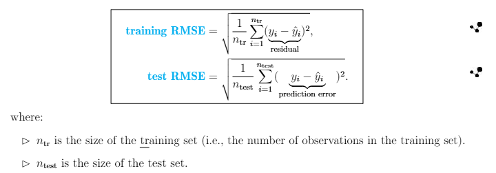

By design, the individual residuals or prediction errors are squared (so that +/i discrepancies will not cancel out), summed, and averaged, followed by taking a square root, to yield the RMSE.

The ***smaller*** the RMSE, the ***better*** the fit of the model to the training / test data.

-   **Mean Squared Error (MSE):** In your prior studies, you may have seen the concept of **Mean Squared Error (MSE)**, which is simply the square of the RMSE:

    

    Due to the square relations, whether you use RMSE or MSE does not really matter, but the advantage of the RMSE over the MSE is that the **RMSE has the same unit as the target variable, making it easier to interpret**.

-   **Mean Absolute Error (MAE):** Instead of the square loss function, we could have used the absolute loss function $L(y_{i},\hat{y}_{i}) = |y_{i}-\hat{y}_{i}|$, in which case the resulting metric is called the mean absolute error (MAE) or mean absolute derivation (MAD):

    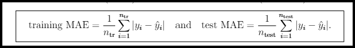

    While the loss function places a much smaller weight on large loss than the square loss function and therefore makes the fitted model more robust against outliers, the square loss function is more frequently used i practice because it is differentiable and eases model fitting, which involves optimizing objective functions.

-   **Fitting vs. Evaluation:** The loss function that defines the performance metric can be the same or different as the one that defines the objective function for training the model. We can for example, use the square loss function to estimate the model parameters (e.g., the method of least squares for linear models) and use the absolute loss function to measure the model performance.

**Exercise 3.1.8 (Calculation of test RMSE)**

You have fitted a predictive model and applied it to the following test set with five observations:

| Observation Number (i) | $y_{i}$ | $\hat{y}_{i}$ |
|:----------------------:|:-------:|:-------------:|
|           1            |    2    |       4       |
|           2            |    5    |       3       |
|           3            |    6    |       9       |
|           4            |    8    |       3       |
|           5            |    4    |       6       |

: ***Table:** Test Set of Five Observations*

Calculate the test RMSE and test MAE.

***Solution:*** The test RMSE is the square root of the average squared prediction error

Test RMSE = $[(1/5)*((2-4)^2 + (5-3)^2 + (6-9)^2 + (8-3)^2 + (4-6)^2)]^{1/2}$ = **3.0332**

Test MAE = $(1/5)*(|2-4| + |5-3| + |6-9)| + |8-3| + |4-6|)$ = **2.8**

**Classification Problems:** For categorical target variables. the predictions are simply labels, or certain factor levels of the target variable, and they cannot be handled algebraically, so the difference may not be well-defined or may not make sense even if it is defined.

Instead of using the square loss or absolute loss function, we use the zero-one loss function (which is actually an indicator function) to come $y_i$ and $\hat{y}_{i}$ meaningfully:

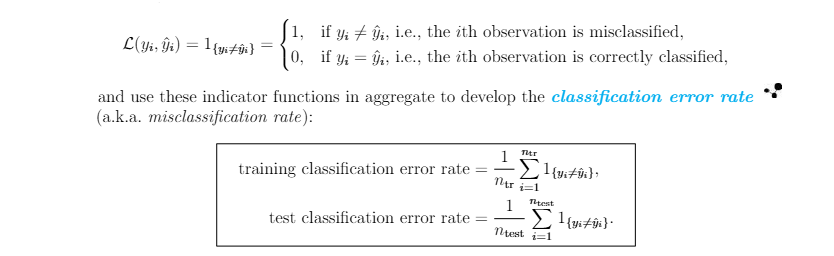

Both RMSE and classification error rate are universal performance metrics that apply to general regression and classification problems, respectively. They can be computed on the training set as ewll as the test set, but as discussed above, we are mainly interested in these performance metrics on the test set, because they measure how well the model fits the test observations, or equivalently how well the model makes predictions on future, unseen data. The goodness of fit of the model to the training set is usually of secondary importance.

In the rest of this manual, we will use the generic term training error to mean the training RMSE or training classification error rate (depending on whether the problem is regression or classification), and test error to mean the test (R)MSE or test classification error rate, as long as there is no confusion.

**Cross Validation**

In predictive analytics, there is a remarkably useful and widely applicable technique, known as **Cross Validation (CV)**, that is an enhanced version of the training/test set split described above. The power of this technique is that it provides means to assess the prediction performance of a model ***without*** ***using using additional test data***. In Exam PA, it also serves an important purpose:

**Purpose of Cross Validation**

:   To select the values of *hyper-parameters (tuning parameters)*, which are parameters that control some aspect of the fitting process itself.

As we mentioned above, model fitting typically involves optimizing a certain objective function, and hyper-parameters often play a role either in the mathematical expression of the objective function, or in the set of constraints defining the optimization problem.

We will encounter concrete examples of hyperparameters in the context of GLMs and Decision Trees in later chapters.

In fact, almost all predictive models in modern use contain one or more hyperparameters that serve as indices of model complexity and need to be tuned carefully to achieve optimal model performance, speaking to their importance in predictive analytics.

------------------------------------------------------------------------

**Example 3.1.9 (Which Types of are Hyperparameters?)**

An actuary is fitting the simple linear regression model $Y = \beta_{0}+\beta_{1}X+\epsilon$ to a set of training data $n_{tr}$ observations. The estimates of $\beta_{0}$ and $\beta_{1}$ are determined by minimizing the function, where $\lambda$ is a given positive constant, for $\beta_{0}$ and $\beta_{1}$ .

Determine which of the parameters is a hyperparameter.

**Solution:** The estimates $\beta_{0}$ and $\beta_{1}$ are output of the minimization problem above, while $\lambda$ is an input that goes into the minimization problem. Therefore, only $\lambda$ is a hyperparameter.

------------------------------------------------------------------------

The tricky part of hyperparameters is that we have to provided their values in advanced; they are not optimized as part of the model fitting algorithm, so it is impossible to select their values given the training set alone.

In theory, we can further divide the training data into two parts. One part for training the model for a given set of hyperparameters under consideration, and one part for evaluating the predictive performance of the model.

Then we select the combination of hyperparameters that gives rise to the best performance. In practice, this will reduce the size of the training set and undesirably undermine the reliability of the model development process.

**Cross Validation (CV)** is an ingenious method for tuning hyperparameters without having to further divide the training set. Given the training set, CV (more formally called ***k-fold CV***) works by performing a series of splits *repeatedly* across the dataset. The procedure is as follows:

-   **Step 1:** For a given positive integer *k*, randomly split the training data into *k* folds of approximately equal size. The value of *k* can range between 2 (smallest) and $n_{tr}$ (largest). A common choice for *k* in practice is 10, which is the default value in many model fitting functions in R.
-   **Step 2:**
    -   One of the *k* folds is left out and the predictive model is fitted to the remaining *k-1* folds. Then the fitted model is used to make a prediction for each observation in the left-out fold and a performance metric is computed on that fold. This is a valid estimate of the prediction performance of the model because observations in the excluded fold are not part of the model training process. In other words, they are something unseen by the model, and we are really making predictions.

    -   Then repeat this process with each fold left out in turn to get *k* performance values, $V_{1}, ...,V_{k}$ (e.g., RMSE for a numeric target and classification error rate for a categorical target).

    -   The overall prediction performance of the model can be estimated as the average of the *k* performance values, known as the **CV error:**

        $$
        \fbox{CV error = (V_{1}+...+V_{k})/k}
        $$

If we have a set of candidate hyperparameter values, then we can perform Step 2 above for each set of values under consideration and select the combination that produces the best model performance.

Then the model is fitted to the ***entire training set*** (i.e., the *k* folds together) using this optimal combination of hyperparameter values and evaluated on the test set.

In fact, CV is such a useful technique that it is automatically built into some of the model fitting algorithms such as regularization and decision trees for tuning model parameters for best performance.

------------------------------------------------------------------------

**Exercise 3.1.10 (Mechanics of *k*-fold CV)**

An actuary has a dataset with n = 50 observations and p = 22 predictors. He is using 10-fold cross-validation to select from a variety of available models.

Calculate the approximate number of observations used for the training models in each round of cross-validation procedure.

**Solution:** 10-fold CV involves (randomly) dividing the data into 10-folds of approximately equal size, each with about 50/10 = 5 observations. In each round, one fold is left out and the other 9 folds, with approximately 9(5) = 45 observations, are used to train a model.

------------------------------------------------------------------------

**Selecting the Best Model**

After fitting each candidate model under consideration to the training set (possibly using CV to tune its hyperparameters) and evaluating its performance on the test set, it is time to select the model that is the "best" in a certain sense. Here are some important considerations that come into play in the selection of the best model:

-   **Prediction Performance:** Choosing the model with the best prediction performance is relatively easy and objective. All we have to do is [***pick the model with the smallest test-RMSE***]{.underline} for a regression problem, or [***smallesttest classification error rate***]{.underline} for a classification problem. We can also use alternative evaluation metrics that capture more specific aspects of prediction performance if appropriate.
-   **Interpretability:** A model that makes good predictions is not always preferable, if it is like a black box and its end users have little idea what goes into the decision-making process. For the final model to earn trust from stakeholders with no expertise in predictive analytics, it should be reasonably interpretable, meaning that the model predictions should be easily explained in terms of the predictors and lead to specific actions or insights.
-   **Ease of Implementation:** Other things equal, the easier for a model to be implemented (computationally, financially, or logistically), the better the model. If the model requires prohibitive resources to construct and maintain (e.g., it takes forever to fit the model, or it is costly to collect values of the necessary predictors), then its end users may not afford to use it in the first place, even if it makes superb predictions.

As we will see in the case studies sections, it is not uncommon for prediction performance to be in conflict with interpretability and ease oimplementation, so the selection of the best model in practice almost always involves a compromise between these conflicting criteria, and the business problem can have quite a strong influence on the "final winner".

-   If the focus of the project you receive in Exam PA is on prediction, then it is worth selecting a model that produces good predictions of the target variable even if the model is rather non-transparent or costly to implement.

-   If interpretation is the primary concern, then it is natural to select a relatively simple, interpretable model that clearly shows the relationship between the target variable and the predictors. Using such a model, we can better understand the association between the two groups of variables and make inference about the underlying data-generating mechanism, thereby making better decisions. Its prediction performance is of secondary importance.

#### Stage 5: Model Validation

After coming up with a tentative model, which appears to be the best among all models you have constructed, we should not rush to recommend it to the client. Instead, we should *validate* it by inspecting it for any obvious deficiencies and ensuring that the assumptions behind the model are largely satisfied. If found, the deficiencies can be used to improve the specification of the model and we will go back to Stage 4. As mentioned at the beginning of this subsection, model building is often an iterative process.

There are different kinds of model validation techniques. They may be performed on either the training set or the test set, and they may be model-dependent in the sense that they are specific to particular types of predictive models.

-   ***Training Set:*** For GLMs, there is a set of model diagnostic tools to check the model assumptions based on the training set. We will learn these tools in Subsections 3.2.2 and 4.1.4.

-   ***Test Set:*** A general model validation technique applicable to both GLMs and Decision Trees is to compare the predicted values and the observed values of the target variable on the test set. The comparison can be quantitative (summarized by a number) or graphical (in form of a plot). If we use graphical means and if the model works well, then the plot of the predicted against the observed values not only should fall on the 45-degree straight line passing through the origin quite closely, the deviation from the line should have no systematic patterns. Here are two example plots:

    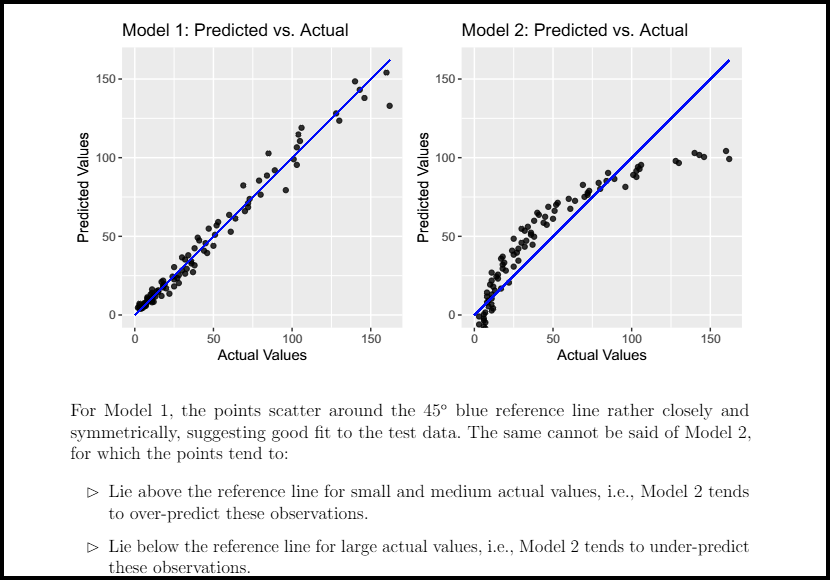

**For this validation technique to be meaningful, it is vitally important that we compare the predicted values and the observed values on the test set, not the training set.**

If we perform the comparison on the training set, then we are only assessing the goodness-of-fit of the model to the training data, not its prediction performance on unseen data. A model may produce actual and "predicted" values on the training set that are in close agreement simply because it is a complex and over-fitted model.

Another validation technique used in some old past PA exams is to compare the selected model to an existing baseline model, again on the test set.

This model is usually a primitive model, such as an Ordinary Least Squares Linear Model (if the selected model is a GLM) or a model that has no predictors and simply uses the average of the target variable on the training set for prediction. The model will provide a benchmark which any selected model should beat as a minimum requirement.

After the selected model has been validated, it can be recommended to the client for their consideration and comments.

#### Stage 6: Model Maintenance

If the client gladly accepts the selected model, then we can put it to actual use and maintain it over time so that it remains useful in the future. Here are some of the steps we can take:

-   **Adjust the Business Problem:** At times, it may help to alter the business problem to take the following into account:

    -   A surprise discovery, e.g., a certain outcome turns out to be far more common or impactful than initially thought
    -   Changes in external factors, e.g., market conditions, regulations that may cause initial assumptions to shift, and justify modifying the business problem to incorporate the new conditions.

-   **Consult with Subject Matter Experts:**

    -   If there are new findings that do not fit your current understanding of the business problem or modeling issues that cannot be easily resolved purely on predictive analytics
    -   To understand the limitations on what can reasonably be implemented.

-   **Gather Additional Data:**

    -   Gather new observations and retrain the model to ensure that it will continue to be predictive in new environments, and to improve its robustness and prediction performance.
    -   Gather new variables, or additional predictors.

-   **Apply New Types of Models:** Try new types of models with different strengths and weaknesses when new technology or implementation possibilities are available.

-   **Refine Existing Models:** Try new combinations or transformations of predictors, different training/test splits, alternative hyperparameter values, performance metrics etc.

-   **Field Test Proposed Model:** Implement the recommended model in the exact way it will be used to gain users' confidence. This is particularly important when the business problem, data, or type of model is new.

### Bias-Variance Trade-Off

This subsection and the next will delve into the model construction stage (Stage 4) more carefully and introduce, in a statistical framework, the technical considerations that go into designing a good predictive model.

**Key Idea: A complex model does not equal a good predictive model**

If you are just beginning to learn predictive analytics, you may be tempted to create a super sophisticated model with a huge number of predictors, some of which may be only marginally related to the target variable, in attempt to maximize the prediction performance of the model.

After all, you don' want the model to miss any potentially useful information. To your surprise, such a complex model does not necessarily make good predictions, contrary to your original intention. As will be discussed in this subsection and substantiated in the rest of the manual, an extremely important mentality to keep in mind when doing predictive analytics is:

Imporatnt Mentality for Predictive Analytics

:   Complexity does ***not*** guarantee good prediction performance

**Goodness of fit vs. Prediction Accuracy**

While complexity does not correlate very well with prediction performance (measured by the test error), it is intimately related to the goodness of fit to the training data (measured by the training error). In other words, goodness of fit to the training data is not quite the same as prediction accuracy, and the two types of error behave very differently with complexity, as Figure 3.1.3 below shows:

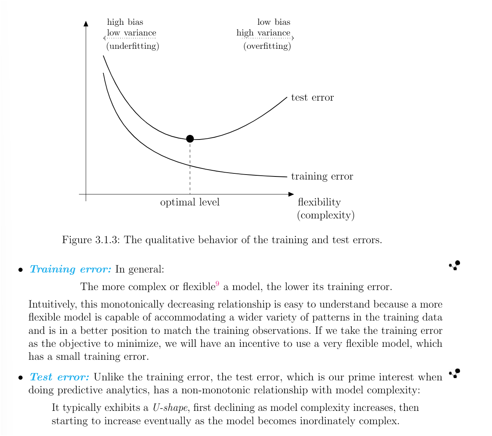

In terms of the training and test errors, we can describe the problems with a model that is either too simple or too complex using the following 2x2 table:

| Scenario | Small Test Error | Large Test Error |
|------------------------|------------------------|------------------------|
| **Small Training Error** | Model is optimal | Model is overfitted |
| **Large Training Error** | Check your code for errors, this is too good to be true and rarely happens in real life | Model is underfitted |

The two undesirable scenarios in the last column of the table, both involve having a large test error, deserve a separate discussion.

**Case 1: Underfitting**

In the left tail of Figure 3.1.3, the model is too simple to capture the training data effectively. Without learning enough about the signal of the data, an ***underfitted*** model matches both the training and test data poorly, and is marked by relatively large training error as well as a relatively large test error. This is akin to a lazy student barely studies ("underfitted") and, not surprisingly, bombs their math test.

**Case 2: Overfitting**

In the right tail of Figure 3.1.3, the model, which is overwhelmingly complex, is overfitting the data. It is fitting the data too hard and goes to extraordinary lengths to capture:

-   The signal, which represents general relationships between the target variable and predictors, applicable to both the trianing and test data.
-   The noise, which represents patterns that are just caused by random chance rather than by true, general properties of the unknown function $f$. These patterns are specific to the training set (i.e., they do not exist in the test data), but are mistreated as if they were signal.

------------------------------------------------------------------------

**Decomposition of the Expected Test Error**

To better understand the U-shape behavior that characterizes the test MSE, it is instructive to break it down into different components, and examine how each of these components behaves. Although such a decomposition is mainly of theoretical nature and you don't often calculate the individual components of the formula in Exam PA, keeping the decomposition in mind will help you understand what it takes to produce good predictions. In particular, it reinforces the practically important idea that more complex models are not necessarily superior models.

For simplicity, we will consider a numeric target variable so that the **(R)MSE** is an appropriate performance metric (categorical target variables admit a similar decomposition).

For a given set of predictor values $X_{0}$, the decomopsition reads:

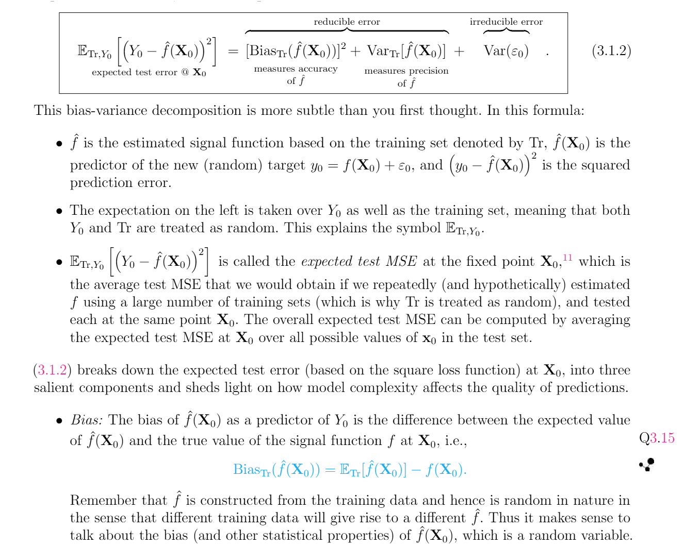

### Feature Generation and Selection

## Linear Models: Conceptual Foundation

### Model Formulation

#### Model Equation

-   Target variable $Y$ is **numeric**.
-   $Y$ is related to predictors $X_1, X_2, \dots, X_p$ via the approximately **linear** relationship

$$
Y = \beta_0 + \beta_1 X_1 + \beta_2 X_2 + \dots + \beta_p X_p + \varepsilon.
$$

-   Linear signal function $f(X)$.

##### Some terms

-   $p = 1$: [Simple linear regression model](#)
-   $p \geq 2$: [Multiple linear regression model](#)
-   $\beta_0$: Intercept
-   $\beta_j$: Coefficient (or slope) of the $j$th predictor

#### Training Data: $\{(Y_i, X_{i1}, X_{i2}, \dots, X_{ip})\}_{i=1}^{n_{tr}}$

-   **Tabular (data frame) format**:

| Training Observation | Target $Y$ | Predictors |
|------------------------|------------------------|------------------------|
|  | $Y$ | $X_1$ $X_2$ ... $X_p$ |
| 1 | $Y_1$ | $X_{11}$ $X_{12}$ ... $X_{1p}$ |
| 2 | $Y_2$ | $X_{21}$ $X_{22}$ ... $X_{2p}$ |
| ... | ... | ... |
| $n_{tr}$ | $Y_{n_{tr}}$ | $X_{n_{tr},1}$ $X_{n_{tr},2}$ ... $X_{n_{tr},p}$ |

-   **Equation format**:

$$
Y_i = \beta_0 + \beta_1 X_{i1} + \beta_2 X_{i2} + \dots + \beta_p X_{ip} + \varepsilon_i, \quad i = 1, \dots, n_{tr}
$$

-   **A default assumption**:

$$
\varepsilon_i \sim \text{i.i.d. } N(0, \sigma^2)
$$

#### Model Quantities

##### On the training set

-   Fitted value $\hat{Y}_i = \beta_0 + \beta_1 X_1 + \cdots + \beta_p X_{ip}$
-   Residual $e_i = Y_i - \hat{Y}_i$ (useful for "diagnosing" a linear model)
-   Residual SS (RSS): $RSS = \sum_{i} e_i^2$ (the lower, the better the fit to the training set)

##### On the test set

-   Predicted value $\hat{Y}^* = \beta_0 + \beta_1 X_1^* + \cdots + \beta_p X_p^*$, where $(1, X_1^*, \ldots, X_p^*)$ is a vector of predictor values of interest.
-   Prediction error $Y^* - \hat{Y}^*$ (the lower, the more predictive the model)

#### Model Quantities (Cont.)

##### Additional quantities computed on the training set

-   **t-statistic**: $t(\hat{\beta_j}) = \frac{\hat{\beta_j}}{\text{standard error of } \hat{\beta_j}}$
    -   Can be used to test the significance of $X_j$ in the presence of all other predictors.
    -   The larger in magnitude, the more significant.
-   **F-statistic**
    -   Can be used to assess the joint significance of all of the $p$ predictors, $X_1, \ldots, X_p$.
    -   The larger, the more significant (but it doesn’t tell which predictors are significant).
-   **Coefficient of determination**
    -   On a scale from 0 to 1.
    -   The larger, the better the fit to the training set.

### Model Evaluation and Validation

#### General Performance Metric

-   $Y$ is numeric $\Rightarrow$ Test (R)MSE

$$
\sqrt{\frac{1}{n_{\text{test}}} \sum_{i=1}^{n_{\text{test}}} (Y_i - \hat{Y}_i)^2}
$$

can be used.

##### Other metrics on the test set

-   Test **loglikelihood** (Exam STAM)
-   Test **coefficient of determination** $R^2$

##### All of them are equivalent because...

They are all functions of

$$
\sum_{i=1}^{n_{\text{test}}} (Y_i - \hat{Y}_i)^2.
$$ \#### Performance Metrics based on Penalized Likelihood

-   Common structure: **Model fit** (ensures good fit) + **Penalty measuring model complexity** (prevents overfitting)

-   **Idea**: To balance goodness of fit to the training data with model complexity\

-   **Criterion**: The smaller, the better the model

##### AIC (Akaike Information Criterion)

-   Definition: $\text{AIC} = -2l + 2p$ \quad $(p = \#\text{parameters})$

##### BIC (Bayesian Information Criterion)

-   Definition: $\text{BIC} = -2l + p \ln n_{\text{tr}}$
-   vs. AIC: A heavier penalty per parameter ($\because \ln n_{\text{tr}} > 2 \Leftrightarrow n_{\text{tr}} \geq 8$)

#### From Past PA Exams

##### June 2019, Task 6: Select features using AIC or BIC

AIC and BIC are among the available techniques for feature selection. Briefly **describe** them and outline the **differences** in the two criteria. Make a recommendation as to which one should be used for this problem.

##### June 17, 2020, Task 7: Select features using stepwise selection

When using the stepAIC function, there are two decisions to make: **forward vs. backward** and **AIC vs. BIC**. **Describe** each decision and the **implications** in choosing one option versus the other.

#### Model Diagnostics based on Residuals

Recall the model assumption by default:

$$
\begin{cases}
Y = X \beta + \varepsilon \\
\varepsilon_i \sim \text{i.i.d. } N(0, \sigma^2)
\end{cases}
\Rightarrow
\begin{cases}
e_i \approx \text{i.i.d. } N(0, \sigma^2) \\
e_i \text{ have no systematic patterns}
\end{cases}
$$

##### Residual analysis

-   Do the residuals behave like this?
    -   If **yes**, model looks good!
    -   If **no**, try to **improve the model**!

#### Two Particularly Useful Plots: "Residuals vs Fitted" Plot

**Uses** - Check **model specification** (are the predictors entered properly?) - Check **homogeneity** of the error variance (**homoscedasticity**)

##### Good {.unnumbered}

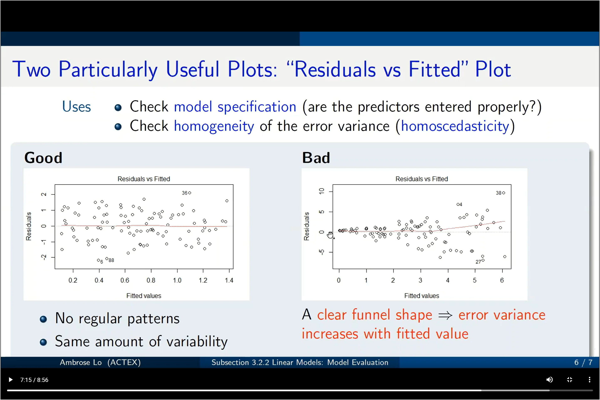 - No regular patterns - Same amount of variability

##### Bad {.unnumbered}

 - A clear funnel shape $\Rightarrow$ error variance increases with fitted value

#### Two Particularly Useful Plots: Q-Q Plot

**What it is**: Graphs the **empirical quantiles** of the standardized residuals against theoretical $N(0, 1)$ quantiles.

**Use**: Check the **normality** of the random errors

##### Good {.unnumbered}

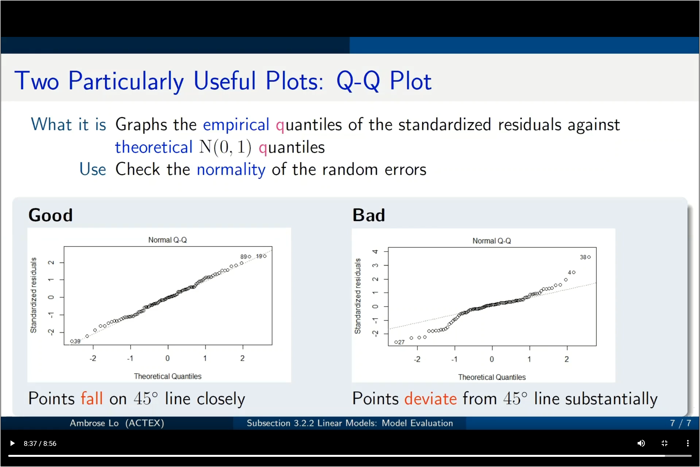 - Points **fall** on 45° line closely

##### Bad {.unnumbered}

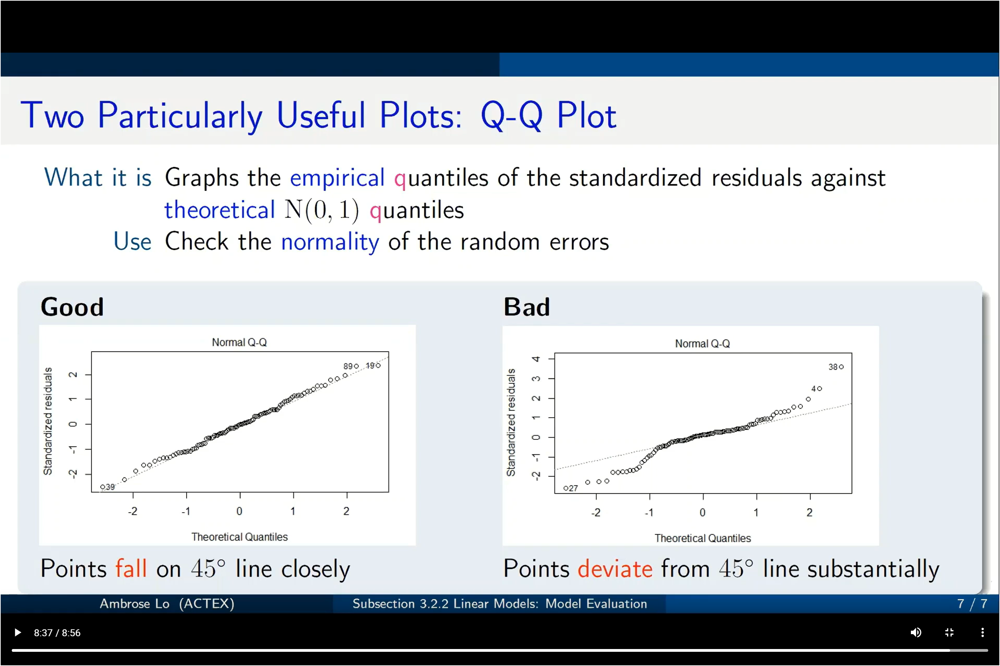 - Points **deviate** from 45° line substantially

### Feature Generation

#### Big Picture {.unnumbered}

**Given**: A list of potentially useful predictors (given on the exam)

##### Practical questions to be addressed {.unnumbered}

-   How do we want these predictors to enter the model equation to achieve what effects?

$$
Y = \beta_0 + \text{[how to fill in this part?]} + \varepsilon
$$

-   How to handle **categorical** predictors in a linear model?

##### Feature generation for linear models {.unnumbered}

Generate **new features** to improve the **flexibility** of a linear model\
$\Rightarrow$ prediction accuracy $\uparrow$

------------------------------------------------------------------------

#### Numeric Predictors

Let $X_j$ be a numeric predictor.

##### Simplest form: Assign a single regression coefficient {.unnumbered}

-   **Model equation**:\
    $$
    Y = \beta_0 + \dots + \beta_j X_j + \dots + \varepsilon
    $$
-   **Interpretation**:
    -   $\beta_j = \frac{\partial \mathbb{E}[Y]}{\partial X_j}$\
    -   $\beta_j$ = the expected change in $Y$ **per unit increase** in $X_j$, holding all other predictors fixed.

##### Polynomial regression {.unnumbered}

-   **Motivation**: To accommodate **non-linear** relationships between $Y$ (e.g., #pedestrians) and $X_j$ (hour)
-   **Model equation**:\
    $$
    Y = \beta_0 + \beta_1 X_j + \beta_2 X_j^2 + \dots + \beta_m X_j^m + \dots + \varepsilon
    $$
    -   $\quad \quad \quad \quad \quad \quad \uparrow \quad \quad \quad \quad \quad \quad \quad \uparrow$\
    -   $\quad \quad \quad$ new features
-   **Interpretation**:
    -   $\frac{\partial \mathbb{E}[Y]}{\partial X_j} = \beta_1 + 2\beta_2 X_j + \dots + m\beta_m X_j^{m-1}$
    -   Coefficients are **harder to interpret!**

------------------------------------------------------------------------

#### Categorical Predictors

##### Binarization {.unnumbered}

Can we assign a regression coefficient directly to a categorical predictor?

For Smoking = $$
\begin{cases}
\text{Smoker} \\
\text{Non-smoker} \\
\text{Unknown}
\end{cases}
$$ can we use $Y = \beta_0 + \beta_1 \times \text{Smoking} + \varepsilon$?

No! Because $\beta_1 \times \text{Smoker}$, $\beta_1 \times \text{Non-smoker}$, and $\beta_1 \times \text{Unknown}$ don’t make sense!

##### Need an extra operation: Binarization {.unnumbered}

A **categorical predictor** $\rightarrow$ A collection of **binary/dummy/indicator variables** indicating one and only one level (= 1 for that level, = 0 otherwise)

Dummy variables are numeric $\Rightarrow$ we can enter them directly in model equation.

------------------------------------------------------------------------

##### Illustrative Example: Smoking {.unnumbered}

###### 3 dummy variables {.unnumbered}

| Level of Smoking | SmokingSmoker | SmokingNon-smoker | SmokingUnknown |
|------------------|---------------|-------------------|----------------|
| Smoker           | 1             | 0                 | 0              |
| Non-smoker       | 0             | 1                 | 0              |
| Unknown          | 0             | 0                 | 1              |

###### Sample dataset {.unnumbered}

| Obs. | Smoking    | SmokingSmoker | SmokingNon-smoker | SmokingUnknown |
|------|------------|---------------|-------------------|----------------|
| 1    | Smoker     | 1             | 0                 | 0              |
| 2    | Unknown    | 0             | 0                 | 1              |
| 3    | Non-smoker | 0             | 1                 | 0              |
| 4    | Smoker     | 1             | 0                 | 0              |

------------------------------------------------------------------------

##### Illustrative Example: Smoking (Cont.) {.unnumbered}

Possible model configurations:

$$
Y = \beta_0 + \beta_1 \times \text{SmokingSmoker} + \beta_2 \times \text{SmokingUnknown} + \varepsilon
$$ $$
Y = \beta_0 + \beta_1 \times \text{SmokingNon-smoker} + \beta_2 \times \text{SmokingUnknown} + \varepsilon
$$ $$
Y = \beta_0 + \beta_1 \times \text{SmokingSmoker} + \beta_2 \times \text{SmokingNon-smoker} + \varepsilon
$$

**Question**: Why not use all three dummy variables?

-   **Intuitively**: When two of them are known, the third brings **no additional information**.
-   **Technically**: Including all three results in **perfect collinearity** and a **rank-deficient model**.

**General rule for a linear model**:\
A categorical predictor with $k$ levels should be represented by $k - 1$ binary variables.\
Left out level = **baseline level**.

------------------------------------------------------------------------

##### Baseline Level {.unnumbered}

-   **R’s default**: The first level in **alpha-numerical order** (e.g., “Non-smoker” for smoking)\
-   **Common practice**: The **most common** (populous) level

###### Interpretation of regression coefficients {.unnumbered}

Consider $$
\mathbb{E}[Y] = \beta_0 + (\beta_1 D_1 + \dots + \beta_j D_j + \dots + \beta_{k-1} D_{k-1}) + \dots
$$ where this represents a $k$-level categorical predictor.

-   In $j$th level: $\mathbb{E}[Y] = \beta_0 + \beta_j (1)$
-   In baseline level: $\mathbb{E}[Y] = \beta_0$
-   **Interpretation**: $\beta_j = \mathbb{E}[Y]$ at $j$th level $- \mathbb{E}[Y]$ at baseline level.

The $\beta_j$'s measure how much the target mean changes over different factor levels compared to the baseline. **They are not change in the target mean per unit change in the dummy variables**.

------------------------------------------------------------------------

#### What is Interaction?

-   **Restriction**: In the basic model form, $Y = \beta_0 + \beta_1 X_1 + \dots + \beta_p X_p + \varepsilon$, the expected effect of each $X_j$ on $Y$ is **independent** of the values of other predictors.

##### Interesting example from *Introduction to Statistical Learning* {.unnumbered}

-   $Y$ = number of units produced in a factory
-   $X_1$ = number of production lines in the factory
-   $X_2$ = number of workers in the factory

**Observation**: The effect of $X_1$ on $\mathbb{E}[Y]$ is likely to **depend on** $X_2$.

**Reason**: If $X_2 = 0$, then increasing $X_1$ will not raise $Y$ much. (No one is working!)

**Interaction**: When the effect of one predictor on the target variable **depends on** the value/level of another predictor.

**Suggestion**: Consider $\mathbb{E}[Y] = \beta_0 + \beta_1 X_1 + \beta_2 X_2 + \beta_3 X_1 X_2$.

-   **Note**:\
    $\mathbb{E}[Y] = \beta_0 + (\beta_1 + \beta_3 X_2) X_1 + \beta_2 X_2 = \beta_0 + \beta_1 X_1 + (\beta_2 + \beta_3 X_1) X_2$
    -   Here, $(\beta_1 + \beta_3 X_2)$ **depends on** $X_2$\
    -   Similarly, $(\beta_2 + \beta_3 X_1)$ **depends on** $X_1$
-   $X_1 X_2$ is the **interaction term**.

------------------------------------------------------------------------

#### Interactions between Continuous and Categorical Predictors {.unnumbered}

##### Model equation: {.unnumbered}

$$
\mathbb{E}[Y] = \beta_0 + \beta_1 X_1 \text{ (continuous)} + \beta_2 X_2 \text{ (binary)} + \beta_3 X_1 X_2
$$

$$
= 
\begin{cases}
\beta_0 + \beta_1 X_1, & \text{if } X_2 = 0, \\
(\beta_0 + \beta_2) + (\beta_1 + \beta_3) X_1, & \text{if } X_2 = 1.
\end{cases}
$$

##### **Graphical Illustration of Interaction** {.unnumbered}

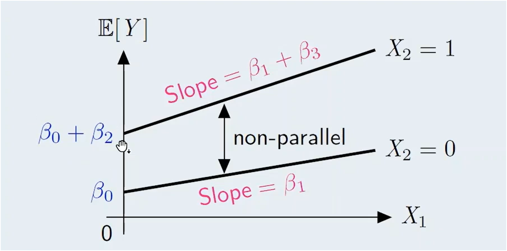

Breakdown of Graph: - If $X_2 = 0$: Slope = $\beta_1$, Intercept = $\beta_0$ - If $X_2 = 1$: Slope = $\beta_1 + \beta_3$, Intercept = $\beta_0 + \beta_2$

-   **Different intercepts** due to $\beta_2 X_2$
-   **Different slopes** due to $\beta_3 X_1 X_2$\
    $\Rightarrow$ **interaction effect**

------------------------------------------------------------------------

#### Interactions between Two Categorical Predictors {.unnumbered}

##### Model equation: {.unnumbered}

$$
\mathbb{E}[Y] = \beta_0 + \beta_1 X_1 \text{ (binary)} + \beta_2 X_2 \text{ (binary)} + \beta_3 X_1 X_2
$$

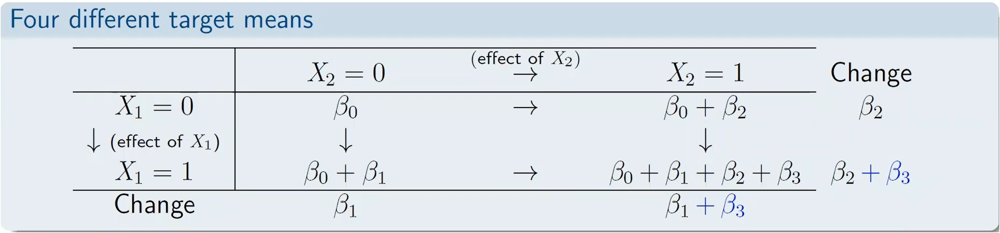

------------------------------------------------------------------------

### Feature Selection

------------------------------------------------------------------------

#### Feature/Model Selection: Big Picture {.unnumbered}

-   **Given**: A full linear model of $p$ (potentially useful) features: $$
    Y = \beta_0 + \beta_1 X_1 + \dots + \beta_p X_p + \varepsilon.
    $$

-   **Task**: Select the **really useful** features, i.e., $$
    Y = \text{?} + \varepsilon.
    $$

-   **Motivation**:\
    Remove features with limited predictive power\
    $\Downarrow$\
    Prevent overfitting and **simplify model**

##### Naive suggestion {.unnumbered}

-   Fit the full model and drop all insignificant features at once.

##### Caveat {.unnumbered}

-   Absence of one feature can affect the significance of other features.

------------------------------------------------------------------------

#### Best Subset Selection {.unnumbered}

##### **Idea** {.unnumbered}

-   Fit all possible $2^p$ linear models constructed from the $p$ features
-   Choose the **“best subset”** of predictors (w.r.t. AIC, BIC, etc.) to form the best model

##### **Merits** {.unnumbered}

-   Conceptually simple
-   Screens all $2^p$ models

##### **Demerits** {.unnumbered}

-   **Computationally prohibitive**; generally not feasible when $p \geq 10$\
    (Note: $2^{10} = 1,024$, $2^{20} = 1,048,576$!!)

##### **Need more efficient feature selection methods!** {.unnumbered}

-   **More efficient solution**: Stepwise selection\
    To look at a **restricted subset** of all possible models.

------------------------------------------------------------------------

#### Stepwise Selection Algorithms

**Backward Stepwise Selection**

:   Start with a **full model** with all $p$ features

    $\downarrow$ Go Backward

    **Drop**, one at a time, the feature to improve the model the most w.r.t. AIC or BIC

    $\downarrow$ Repeat until

    Stop when no features can be **dropped** to improve the model.

**Forward Stepwise Selection**

:   Start with a **intercept-only** model ($Y=\beta_0+\epsilon$)

    $\downarrow$ Go Forward

    **Add**, one at a time, the feature to improve the model the most w.r.t. AIC or BIC

    $\downarrow$ Repeat until

    Stop when no features can be **added** to improve the model.

------------------------------------------------------------------------

#### **Discussion** {.unnumbered}

-   **Backward**: Once dropped, the feature will be gone forever\
-   **Forward**: Once added, the feature will stay forever\
-   **Max. \# models fitted**: $$
    1 + \frac{p(p+1)}{2} \quad (p=20 \Rightarrow 211, \text{ vs. } 2^{20} > 1 \text{ million})
    $$
-   **Drawback**: No guarantee final model is best

##### **Two important decisions: Selection criterion and selection process** {.unnumbered}

###### **AIC/BIC** {.unnumbered}

-   Prefer a **simpler model** $\Rightarrow$ BIC (**more conservative**)
-   Don’t want to miss important predictors $\Rightarrow$ AIC
-   No universally superior choice; **keep business problem in mind** (key!)

###### **Backward/Forward** {.unnumbered}

-   **Forward selection** tends to produce a **simpler model**.
-   **Backward selection** tends to produce a more **complex model**.
-   Again, no universally superior choice

------------------------------------------------------------------------

### Regularization

#### **How Does Regularization (a.k.a. Shrinkage) Work?** {.unnumbered}

##### **Stepwise Selection** {.unnumbered}

-   Search through a **list** of candidate models $\rightarrow$ final model
-   Set $\beta_j = 0$ for non-predictive features in full model

##### **Regularization** {.unnumbered}

-   Fit a **single model** with all $p$ features using a “special technique”
-   $\beta_j \approx 0$ for non-predictive features $\Rightarrow$ smaller effect on target

##### **Ordinary Least Squares (OLS)** {.unnumbered}

$$
\min_{\beta_0, \beta_1, \dots, \beta_p} \sum_{i=1}^{n_{tr}} \left[ Y_i - \left( \beta_0 + \beta_1 X_{i1} + \beta_2 X_{i2} + \dots + \beta_p X_{ip} \right) \right]^2
$$ - **RSS** (Residual Sum of Squares)

##### **Loss + Penalty Formulation** {.unnumbered}

$$
\min_{\beta_0, \beta_1, \dots, \beta_p} \text{RSS} + \lambda f_R(\beta)
$$

**Where:**

-   $\lambda$: **Regularization parameter**; the larger, the heavier the regularization
-   $f_R(\cdot)$: **Penalty function**; reflects the size of slope coefficients
-   Adds a **regularization penalty** to the loss function

$Idea$**: Make a Trade-Off Between:**

-   **Goodness-of-Fit to Training Data** (captured by **RSS**): Smaller $\rightarrow$ Better -
-   **Model Complexity** (captured by **Regularization Penalty**): Smaller $\rightarrow$ Better

------------------------------------------------------------------------

#### **How does Regularization (a.k.a. Shrinkage) Work? (Cont.)** {.unnumbered}

-   **Objective function**: $\text{RSS} + \lambda f_R(\beta)$
-   **Output**: A **family** of coefficient estimates $\{\hat{\beta}_\lambda = (\hat{\beta}_{0,\lambda}, \hat{\beta}_{1,\lambda}, \dots, \hat{\beta}_{p,\lambda}) : \lambda \geq 0\}$

##### **Effects of** $\lambda$ (Bias-Variance Trade-Off Again!) {.unnumbered}

-   **Case 1**: When $\lambda = 0$, coefficient estimates = ordinary least squares estimates.
-   **Case 2**: $\lambda \uparrow \Rightarrow |\hat{\beta}_{j,\lambda}| \downarrow \Rightarrow$ flexibility $\downarrow$
    -   Bias$^2$ $\uparrow$
    -   Variance $\downarrow$
    -   **Hopefully** $\Rightarrow$ prediction performance $\uparrow$
-   **Case 3**: When $\lambda \to \infty$, $\hat{\beta}_{j,\lambda} \to 0$ for all $j = 1, \dots, p$ (intercept-only model).

##### **Different Indexes of Model Complexity** {.unnumbered}

-   **Stepwise selection**: $p$ (\# features)
-   **Regularization**: $\lambda$

------------------------------------------------------------------------

#### **Different Choices of** $f_R(\beta)$ (Penalty Function) {.unnumbered}

-   **Ridge Regression**: $f_R(\beta) = \sum_{j=1}^{p} \beta_j^2$
-   **Lasso**: $f_R(\beta) = \sum_{j=1}^{p} |\beta_j|$
-   **Elastic Net**: $f_R(\beta) = (1 - \alpha) \sum_{j=1}^{p} \beta_j^2 + \alpha \sum_{j=1}^{p} |\beta_j|$
    -   $\alpha \in [0, 1]$ is the mixing coefficient
    -   $\alpha = 0$: Ridge regression
    -   $\alpha = 1$: Lasso

##### **Feature Selection Property of Elastic Net** {.unnumbered}

-   For lasso (and elastic net with $\alpha \neq 0$):
    -   $\lambda$ large enough $\Rightarrow$ some $\hat{\beta}_{j,\lambda} = 0$ exactly $\Rightarrow$
        -   **features dropped**
        -   **model simplified!**

**Note:** Ridge regression never drops the features entirely. If the business problem wants you to identify the key factors effecting the target variable, then it makes sense to use the lasso or elastic net with a positive $\alpha$ so that your model will drop the features with limited predictive power and become easier to interpret.

------------------------------------------------------------------------

#### **Hyperparameter Tuning** {.unnumbered}

$\lambda$ and $\alpha$ are hyperparameters, so they are not determined as part of the optimization procedure.

##### **Tuning** $\lambda$ and $\alpha$ by CV {.unnumbered}

-   Divide training data into $k$ folds (e.g., $k = 10$).
-   For each pair of candidate values of $(\lambda, \alpha)$, train the model on all but one fold and measure performance on the left-out fold.
    -   Repeat and compute the average (R)MSE.

| Combination | $\alpha$ | $\lambda$ | CV error (RMSE) |
|-------------|----------|-----------|-----------------|
| 1           | 0.1      | 0.01      | XXX             |
| 2           | 0.1      | 0.02      | XXX             |
| 3           | 0.1      | 0.03      | XXX             |
| ...         | ...      | ...       | ...             |

-   Choose the pair with the **lowest CV error**.

------------------------------------------------------------------------

#### **Pros and Cons of Regularization** {.unnumbered}

##### **Merits** {.unnumbered}

1.  **Binarization**: The `glmnet()` function automatically binarizes categorical predictors.

    -   Each factor level is treated as a separate feature to be removed.

2.  **Tuned by cross-validation**: Uses the same criterion (RMSE) that will ultimately be used to judge the model against unseen test data.

3.  **Variable selection**: For lasso (and elastic nets), increasing $\lambda$ sufficiently can perform variable selection.

##### **Demerits** {.unnumbered}

1.  **Restricted model forms**: The `glmnet()` function can accommodate some, but not all, distributions for GLMs (e.g., gamma).

2.  **Interpretation**: Features are standardized, making coefficient estimates for standardized features harder to interpret.

------------------------------------------------------------------------

## Case Study 1: Fitting Linear Models in R

### **About this Case Study** {.unnumbered}

#### **Dataset** {.unnumbered}

-   **Advertising dataset** from ISLR
    -   Simulated (i.e., not real data)
    -   Involves a **marketing** context
    -   Useful for illustrating many **modeling concepts**, e.g., **polynomial regression** and **interaction effects**.

#### **Objectives** {.unnumbered}

-   Know how to fit a linear model using the `lm()` function and **interpret its output**.
-   Appreciate why variable significance may change as a result of **correlations** between variables.
-   Generate additional features, e.g., **interaction** and **polynomial** terms.
-   Generate **predictions** on the test set using the `predict()` function.

------------------------------------------------------------------------

#### **Setting** {.unnumbered}

-   **Sales** (target variable): The model aims to predict sales.
-   **Predictors**: TV, radio, and newspaper are the potential predictors.
    -   The question to answer: Which of them is/are useful?

##### **Strategic Value of the Model** {.unnumbered}

-   Develop a profitable **marketing plan** by specifying how much should be spent on the three media channels to **maximize sales**.

We start off by loading the advertising dataset into a variable named `ad`. We preview the data using the `head()` function and notice there is an index column `X`, so we remove the data by setting `ad$X <- NULL`.

```{r echo=TRUE}
# Read and view the data
ad <- read.csv(url("https://www.statlearning.com/s/Advertising.csv"))
head(ad)

# We remove the column `X` as it is just an index column
ad$X <- NULL
```

------------------------------------------------------------------------

### Exploratory Data Analysis

#### **TASK 1: Explore the Data** {.unnumbered}

**Task Statement:** Examine the distribution of the four variables. For each, perform the following:

-   Show key **descriptive statistics**.
-   Create **visual representations**.
-   State your observations from the descriptive statistics and visual representations. In particular, form preliminary conclusions regarding which variables are likely to have **significant predictive power**.

------------------------------------------------------------------------

#### **Univariate Exploration** {.unnumbered}

The following code creates a summary of descriptive statistics:

```{r echo=TRUE}
# Create a summary of the data to show the descriptive statistics
summary(ad)
```

Observations:

-   The distribution of `sales` goes from 1.60 to 27.00 and the mean and median are pretty close to each other, implying that the distribution is symmetrical.
-   The same goes for `TV` and `radio`, their mean and median are pretty close, and therefore somewhat symmetrical.
-   For `newspaper`, the mean is greater than the median, implying that the distribution is right-skewed.

The following code graphs the distributions of target variable and predictors using histograms. Histograms are appropriate here, because we have 4 numeric variables:

```{r echo=TRUE}
# CHUNK 3
library(ggplot2)
library(gridExtra)

p1 <- ggplot(ad, aes(x = sales)) +
  geom_histogram()
p2 <- ggplot(ad, aes(x = TV)) +
  geom_histogram()
p3 <- ggplot(ad, aes(x = radio)) +
  geom_histogram()
p4 <- ggplot(ad, aes(x = newspaper)) +
  geom_histogram()

grid.arrange(p1, p2, p3, p4, ncol=2)

```

Observations: - The distribution of `sales` is approximately symmetrical, which is good because a linear model implicitly assumes a normal distribution. - There is a fair amount of right-skewness for `newspaper`, so if you like, you could apply a log-transformation.

#### **Bivariate Exploration** {.unnumbered}

Because all of the variables are numeric, we will use scatterplots and correlation matrix to perform bivariate exploration.

##### **Correlation Matrix** {.unnumbered}

The following code creates a correlation matrix:

```{r echo=TRUE}
# Create a correlation matrix
cor(ad)
```

Since the target variable is `sales`, the correlation coefficients in the last row or last column are of interest. If you look at the correlations of the three predictors, you can see that `sales` has a strong correlation with the predictor `TV`, and a mildly positive correlation with `radio`.

So on the basis of correlations, we can say that `TV` and `radio` are likely to be important predictors of `sales`.

These findings will be confirmed by the linear models we are going to construct later on. Those models will confirm the predictive power of `tv` and `radio`, but `newspaper` is not a very useful predictor of `sales`.

##### **Scatterplots** {.unnumbered}

The following code creates scatterplots of the predictor variables against the target variable:

```{r, echo=TRUE}
# Create scatterplots of the predictor variables against the target variable
p1 <- ggplot(ad, aes(x = TV, y = sales)) +
  geom_point() +
  geom_smooth(method = "lm", se = FALSE)
p2 <- ggplot(ad, aes(x = radio, y = sales)) +
  geom_point() +
  geom_smooth(method = "lm", se = FALSE)
p3 <- ggplot(ad, aes(x = newspaper, y = sales)) +
  geom_point() +
  geom_smooth(method = "lm", se = FALSE)
grid.arrange(p1, p2, p3, ncol=3)
```

The association between `sales` and `TV` is quite strong and positive. The blue line is the linear regression line fitted to the data. If we spend more on `TV`, there is a strong tendancy for `sales` to go up as well.

The same for `radio`, we can see a mild positive relationship between `sales` and `radio`. For `newspaper`, the relationship is more ambiguous, still positive, but much weaker than `TV` and `radio`.

What we've observed in the scatterplots is consistent with the correlation matrix previously analyzed.

```{r, echo=TRUE}
# Alternative: Create a scatterplot matrix
pairs(ad)
```

------------------------------------------------------------------------

### Simple Linear Regression

#### **TASK 2: Construct Simple Linear Regression Models** {.unnumbered}

**Task Statement** - Fit three separate **simple linear regression** models for **sales** on each of **TV**, **radio**, and **newspaper**. Run the summary function on each model and provide the output.

Using the model for sales on TV as an illustration, perform the following: - **Interpret** the estimated coefficient for TV. - Comment on the **statistical significance** of TV. - Comment on the goodness of fit of this model and interpret the value of the **coefficient of determination**. - **Predict** the value of sales when TV equals 0, 100, 200, or 300.

If one and only one of the three advertising media can be included as a predictor for sales, **recommend which medium** you would choose.

------------------------------------------------------------------------

In CHUNK 6, we are going to fit a simple linear regression model for `sales` against `TV`. In R, linear models are fitted using the `lm()` function. In the `lm()` function, we provide an equation providing the target variable and the predictors.

We use the `~` tilde character to separate the target variable on the left, and the predictors on the right. In this case, we have only one predictor, `TV`. We also have to tell R where the variables are stored, through the `data =` parameter.

```{r echo=TRUE, include=TRUE, message=TRUE}
# CHUNK 6
slr.TV <- lm(sales ~ TV, data = ad)
slr.TV
```

We can interpret the slope for `TV` (=0.04754) as for every unit increase in the predictor `TV`, sales is expected to go up by 0.04754.

We can interpret the intercept of the linear model as, if `TV` is zero, then sales is expected to be 7.03259.

To get more useful information about our fitted linear model, we can run the `summary()` function on an `lm()` object.

```{r echo=TRUE, message=TRUE}
# CHUNK 7
summary(slr.TV)
```

This summary provides additional useful columns regarding the coefficients, the `Std. Error` column and the `t value` column, which is the ratio of `Estimates` column to the `Std. Error` column. The last column, `Pr(>|t|)` is the p-value for testing hypothesis of whether the true coefficient is zero or not.

Here the p-values are very small and close to zero, and the smaller the p-value, the more evidence we have against the null hypothesis in favor of the alternative.

So in this case, we have very strong evidence to say that `TV` is extremely significant due to having a lot of `***` next to it. The more `*` next to a variable, the more significant the variable is.

The last three lines contain information on more global aspects of the linear model. The most important one is the **Multiple R-Squared** which is the **Coefficient of Determination**.

For this fitted model, the **Multiple R-Squared** or **Coefficient of Determination** = 0.6119, therefore 61.19% of the variation in `sales` is explained by the presence of `TV`.

The next code chunk provides a confidence interval for the intercept and coefficients:

```{r echo=TRUE}
# CHUNK 8
confint(slr.TV)
```

The next code chunk uses the `predict()` function on the simple linear regression model of `sales` on `TV` and use the `head()` function to look at the first six predictions:

```{r echo=TRUE}
# CHUNK 9
head(predict(slr.TV))
```

When the `predict()` function is used on a model without any additional arguments, what we will get are the predicted values on the training set.

In the next code chunk, we supply some new data where we want to make some predictions, using the simple linear model. This is done by supplying the `newdata` argument.

```{r echo=TRUE}
# CHUNK 10
predict(slr.TV, newdata = data.frame(TV = seq(0, 300, by = 100)))
```

Similarly, we create simple linear regression models for `radio` and `newspaper`, and print the model summaries of both:

```{r echo=TRUE}
# CHUNK 11
slr.radio <- lm(sales ~ radio, data = ad)
slr.newspaper <- lm(sales ~ newspaper, data = ad)

summary(slr.radio)
summary(slr.newspaper)
```

The model summaries show that both `radio` and `newspaper` are statistically significant, however, the **Multiple R-Squared** or **Coefficient of Determination** is only 33.20% for `radio` and 5.212% for `newspaper`, which means a smaller amount of variation in `sales` is explained by the presence of `radio` and `newspaper`, then is for `TV`.

Since all three models have the same level of complexity, if we had to choose one, then we would choose the SLR model for `TV`, since it has the highest Multiple R-Squared, because it has the best fit to the training data.

------------------------------------------------------------------------

### Multiple Linear Regression

#### **TASK 3: Construct a Basic Multiple Linear Regression Model** {.unnumbered}

**Task Statement**

Fit a multiple linear regression model for **sales** on **TV**, **radio**, and **newspaper**. Then do the following:

-   **Interpret** the estimated coefficients.
-   Comment on the **goodness of fit** of this model.
-   Discuss how the statistical significance of **newspaper** in this model **differs** from that in the simple linear regression model in Task 2. Based on your observations in Task 1, explain why this might be the case.
-   Refit the model by **dropping the insignificant variable(s)**.

In the following code chunk, we will fit the linear model for `sales` on all of the three advertising mediums.

There are two ways to specify the model formula. The longer method uses the addition sign `~ X1 + ... + Xn` to include each of the predictors, while the shorter method uses the period character, `~ .`, to mean "all other variables".

```{r echo=TRUE}
# CHUNK 12
# Long way
model.1 <- lm(sales ~ TV + radio + newspaper, data = ad)
# OR the shorthand...
model.1 <- lm(sales ~ ., data = ad)

# View summary of linear model
summary(model.1)
```

The Multiple R-Squared, or Coefficient of Determination, is 0.8972. Therefore, 89.72% of the variation in `sales` can be explained by the presence of `TV`, `radio`, and `newspaper` together.

Compared to the Multiple R-Squared from the individual simple linear regression models, where the highest Multiple R-Squared was 61.19%, there is a **huge improvement in the goodness-of-fit**. The information contributed from providing the two additional advertisement mediums is useful for explaining the behavior of `sales`.

In the summary output, we can see that now only two of the predictors, `TV` and `radio` are statistically significant (indicated by the `***`), while `newspaper` is not. The multiple linear regression model and the simple linear regression model disagree on the significance of `newspaper`.

**Question:** Is `newspaper` significant or insignificant for sales after all?

-   **Different Conditions**:
    -   **Simple Linear Regression:** `newspaper` is an important predictor of sales **without** accounting for effects of `TV` and `radio` (i.e., their values are **not fixed**).
    -   **Multiple Linear Regression:** `newspaper` is an unimportant predictor of sales **after** accounting for effects of `TV` and `radio` (i.e., their values are **fixed**).
-   **From the Correlation Matrix**:
    -   **`radio`** $\uparrow$ $\Rightarrow$ **`sales`** $\uparrow$ (based on multiple linear regression)
    -   **`radio`** $\uparrow$ $\Rightarrow$ **`newpaper`** $\uparrow$ (based on correlation matrix)
    -   $\therefore$ **`sales`** and **`newspaper`** ("surrogate" for radio) tend to $\uparrow$ together

This can be seen calculating the correlation of residuals between a linear model with of `sales` on `TV` and `radio` against a linear model of `newspaper` on `TV` and `radio`:

```{r echo=TRUE}
# CHUNK 13
m1 <- lm(sales ~ TV + radio, data = ad)
m2 <- lm(newspaper ~ TV + radio, data = ad)

cor(m1$residuals, m2$residuals)
```

The next code chunk drops the insignificant variable (`newspaper`) and refits the model, then prints a summary of the new linear model:

```{r echo=TRUE}
# CHUNK 14
model.2 <- lm(sales ~ TV + radio, data = ad)

# OR regress sales on all media except newspaper
# model.2 <- lm(sales ~ . - newspaper, data = ad)

summary(model.2)
```

The model summary for `model.2` shows that `TV` and `radio` continue to be significant predictors of `sales` based on the very small p-values (indicated by `***` in the coefficient summary).

The Multiple R-Squared or Coefficient of Determination is 89.72%, which is the same as the previous model up to four decimal places $\Rightarrow$ Removing `newspaper` has a negligible impact on the goodness-of-fit of the linear model.

In the rest of this case study, we will use `model.2` as the starting point and add new features to make the model more flexible and more predictive.

------------------------------------------------------------------------

#### **TASK 4: Construct a Multiple Linear Model with Interaction** {.unnumbered}

**Task Statement**

CHUNK 15 shows a three-dimensional scatterplot for sales against TV and radio.

-   Explain why the scatterplot suggests that there may be an interaction between TV and radio.
-   Fit a multiple linear regression model for sales against TV and radio *with interaction*. Provide the summary output.
-   Interpret the estimated coefficient for the interaction term.
-   Provide evidence that the interaction is significant.

The following code chunk creates a three-dimensional scatterplot the linear model of `sales` against `TV` and `radio`:

```{r echo=TRUE}
# CHUNK 15

# Uncomment these lines the first time you run this chunk
#install.packages("car")  
#install.packages("rgl")

# Load the car and rgl packages
library(car)
library(rgl)

# Create a 3D scatterplot of the linear model `sales` on `TV` and `radio`
scatter3d(sales ~ TV + radio, data = ad)
```

In the plot, purple plane is the signal function and the dots are the data from the `ad` dataset.

If we rotate the three-dimensional plot to a birds-eye view, the observations above the regression plane are represented by the yellow-colored dots and have a positive residual and display a systematic pattern – they lie along the 45-degree line on the x-y plane and represent the instances where the company allocates advertising expenditures to **both** `TV` and `radio` and are under-predicted.

The observations below the regression plane are represented by the gray-colored dots and have a negative residual, and represent observations where the marketing company allocates advertising expenditures to either `TV` or `radio`, but not both, and are over-predicted.

These findings suggest that there may be a synergy effect between `TV` and `radio`. If the company combines both `TV` and `radio`, it may lead to a bigger boost in `sales` than using just one advertising medium.

However, this synergy is not taken into consideration by `model.2` which assumes that `TV` and `radio` contribute to `sales` independently. We know that `model.2` is fairly good, considering that the Multiple R-Squared is 89.72%, but we may be able to adapt it to include interaction effects to make it even better.

In the next code chunk, we fit the linear model for `sales` against `TV` and `radio`, together with the interaction term `TV * radio`. Two methods in R for doing so are provided:

```{r echo=TRUE}
# CHUNK 16
model.3 <- lm(sales ~ TV * radio, data = ad)

# OR
# model.3 <- lm(sales ~ TV + radio + TV:radio, data = ad)

summary(model.3)
```

Based on the model summary for `model.3`, all of the terms (`TV`, `radio`, and `TV:radio`) are statistically significant (indicated by the `***` and the small p-values).

The interaction term `TV:radio` has a larger `t-value` (20.727) than the individual terms `TV` (12.699) and `radio` (3.241), so it's the most statistically significant term in the model.

**How can we interpret the coefficient estimate of the interaction term `TV:radio` (1.086e-03)?**

If you differentiate the expected value of `sales` with respect to `radio` (e.g., you want to look at the effect of radio on sales), then this expression involves `TV` because of the interaction term:

$$
\frac{\partial}{\partial \text{radio}} \hat{\text{sales}} = 0.02886 + 0.001086 \times \text{TV}
$$

$\Rightarrow$ For every unit increase in `TV`, the effect of `radio` on `sales` will increase by $\fbox{0.001086}$.

Similarly, we can say that the effect of `TV` on `sales` will increase by $\fbox{0.001086}$ for every unit increase of `radio`:

$$
\frac{\partial}{\partial \text{TV}} \hat{\text{sales}} = 0.02886 + 0.001086 \times \text{radio}
$$

In addition, the Multiple R-Squared or Coefficient of Determination is 0.9678 or 96.78%, which is a significant improvement from `model.2`, which only had an $R^2 = 89.72$% $\Rightarrow$ We can say that `model.3` fits the training data much better than `model.2`. The improvement in the goodness-of-fit is remarkable when including the interaction term.

In the remainder of the case study, we will see that the interaction term will improve the prediction performance of the linear model quite substantially.

------------------------------------------------------------------------

### Evaluation of Linear Models

#### TASK 5: Evaluate Three Marketing Plans {.unnumbered}

##### **Task statement** {.unnumbered}

Suppose that as the manager of the company, you are given a total of \$100,000 to spend on advertising. Three ways to allocate the budget between TV and radio advertising:

1.  Spending the **entire amount** on radio advertising.
2.  **Splitting** the budget **evenly** between TV and radio advertising.
3.  Spending **\$70,000** on radio advertising and **\$30,000** on TV advertising.

Evaluate these three marketing plans using the interaction model constructed in Task 4.

| Plan | `TV` | `radio` |
|:----:|:----:|:-------:|
|  1   |  0   |   100   |
|  2   |  50  |   50    |
|  3   |  30  |   70    |

: **Task 5 Table:** Combinations of `TV` and `radio` to use in `model.3`

In the following code chunk, we first set up a data frame containing the three pairs of predictor values. Then we put this data frame in the `newdata` argument of the `predict()` function and make predictions:

```{r echo=TRUE}
# CHUNK 17
dat.budget <- data.frame(TV = c(0, 50, 30), radio = c(100, 50, 70))
predict(model.3, newdata = dat.budget)
```

Based on the predicted sales amount, the marketing strategy consisting of splitting the budget evenly between `TV` and `radio` results in the largest predicted value of `sales` $\Rightarrow$ Our recommendation is to use the second marketing plan.

------------------------------------------------------------------------

#### TASK 6: Construct a Model with Interaction and Polynomial Terms {.unnumbered}

##### Task statement {.unnumbered}

Your supervisor has suggested that adding the **square of TV** as a feature may improve the multiple linear regression model.

-   Explain, without running any models, why this is or is not a reasonable suggestion.
-   Regardless of your conclusion, fit a multiple linear regression model for sales against TV and radio with interaction and the **square of TV** added. Provide the summary output.

##### Model 4 {.unnumbered}

$$
\text{sales} = \beta_0 + \beta_1 \times \text{TV} + \beta_2 \times \text{radio} + \beta_3 \times \text{TV}^2 + \beta_4 \times \text{TV} \times \text{radio} + \epsilon
$$

In the following code chunk, we will refine `model.3` by adding the square of `TV` added as an additional feature:

```{r echo=TRUE}
model.4 <- lm(sales ~ TV * radio + I(TV^2), data=ad)
summary(model.4)
```

**Note:** The `I()` function in R will process its interior contents in arithmetic manner.

Based on the output of the model summary, all terms of the linear model are statistically significant (indicated by the `***` and small p-values).

The coefficient of `I(TV^2)` is negative (-1.097e-04), so `sales` and `TV` are related by a downward parabola in `model.4`, consistent with what we saw in CHUNK 5.

The Multiple R-Squared or Coefficient of Determination for `model.4` is 0.986 or 98.6%, which is higher than the Multiple R-Squared produced by `model.3` $\Rightarrow$ The goodness-of-fit of `model.4` is almost perfect (e.g., the $R^2$ is almost 1) thanks to including the interaction term and the square term.

So in this case study, both the interaction term and square term are useful features for describing the data, and we will further confirm their usefulness in the last task of the case study.

------------------------------------------------------------------------

#### TASK 7: Choose a Model {.unnumbered}

**Task statement**

1.  Split the data into **training** and **test** sets.
2.  Evaluate the **prediction performance** of the models in Tasks 3, 4, and 6. Recommend which model should be used.

| Model | Task | Formula                                       |
|-------|------|-----------------------------------------------|
| 1     | 2    | sales \~ TV + radio + newspaper               |
| 2     | 3    | sales \~ TV + radio                           |
| 3     | 4    | sales \~ TV \* radio                          |
| 4     | 6    | sales \~ TV \* radio + I(TV\^2)               |
| 5     | –    | sales \~ TV \* radio + I(TV\^2) + I(radio\^2) |

-   **Note:** The `I()` function is used in R to indicate mathematical operations within formulas.

**Steps**

-   **Data Split:** Use a predefined split ratio (e.g., 70/30) to separate the data into training and test sets.
-   **Model Evaluation:** Use a metric such as RMSE to compare prediction accuracy on the test set across the models.
-   **Model Recommendation:** Select the model with the best balance between complexity and predictive accuracy.

In the following code chunk, we use the `caret` package to split the data into a training and test set:

```{r echo=TRUE}
# CHUNK 19
# Install packages
# Uncomment this line the first time you use caret
#install.packages("caret")

# Load packages
library(caret)

# Set the random seed so that the results are reproducible
set.seed(1)

# Create a data partition
partition <- createDataPartition(ad$sales, p = 0.7, list = FALSE)

# Split the data into training and test sets
data.train <- ad[partition, ]
data.test <- ad[-partition, ]
```

You can see that there are 142 observations in the training set (\~70%), and 58 observations in the test set (\~30%).

The `createDataPartition()` function from the `caret` package has built-in functionality to ensure that the target variable follows the same distribution both the training set and the test set. This way the two sets will be representative of the target variable.

We can check this by applying the `summary()` function on the target variable in each of the two sets:

```{r echo=TRUE}
# CHUNK 20
print("TRAIN")
summary(data.train$sales)

print("TEST")
summary(data.test$sales)
```

In the following code chunk, we will fit all models considered on the training set of data:

```{r, echo=TRUE}
model.1.tr <- lm(sales ~ TV + radio + newspaper, data=data.train)
model.2.tr <- lm(sales ~ TV + radio, data=data.train)
model.3.tr <- lm(sales ~ TV * radio + newspaper, data=data.train)
model.4.tr <- lm(sales ~ TV * radio + I(TV^2) + newspaper, data=data.train)
model.5.tr <- lm(sales ~ TV * radio + I(TV^2) + I(radio^2), data=data.train)
```

**Training RMSE**

In the following code chunk, we will use the `RMSE()` function in the `caret` package to calculate the training RMSE for each of the five trained models.

The `RMSE()` function takes a vector of target variable values, and a vector of predicted fitted-values, and we will see what we can observe from the results:

```{r echo=TRUE}
# CHUNK 22
print("TRAIN")
RMSE(data.train$sales, predict(model.1.tr))
RMSE(data.train$sales, predict(model.2.tr))
RMSE(data.train$sales, predict(model.3.tr))
RMSE(data.train$sales, predict(model.4.tr))
RMSE(data.train$sales, predict(model.5.tr))
```

Based on the results of the `RMSE()` function, the RMSE decreases as we go from `model.2.tr` to `model.5.tr`. This makes sense, as `model.2.tr` is the simplest model, and become more complex as we move to `model.1.tr` and then `model.3.tr`, `model.4.tr`, and finally `model.5.tr`.

The more complex the model, the smaller the training error in general.

**What about the Test RMSE?**

We know that performance in the test set is what we actually care about. We generate the five test RMSE statistics in the following code chunk.

Note that we use the `data.test$sales` as the vector of target variable values, and use `predict(model.#.tr, newdata=data.test)` as the vector of predicted fitted-values, specifying the `newdata` argument to use the `data.test` test set observations:

```{r echo=TRUE}
# CHUNK 23
print("TEST")
RMSE(data.test$sales, predict(model.1.tr, newdata = data.test))
RMSE(data.test$sales, predict(model.2.tr, newdata = data.test))
RMSE(data.test$sales, predict(model.3.tr, newdata = data.test))
RMSE(data.test$sales, predict(model.4.tr, newdata = data.test))
RMSE(data.test$sales, predict(model.5.tr, newdata = data.test))
```

Based on the results of the above code chunk, the lowest test RMSE is achieved by `model.4.tr`, and therefore has the best perdiction performance.

The most complex model, `model.5.tr`, is not the best prediction performance and may have overfitted the data, so don't think that using the most complex model is always the best idea as far as prediction is concerned.

If we have to recommend one model out of these five models, our recommendation would be to use `model.4.tr` as it produces the best prediction performance on the test set, is flexible enough to capture the signal in the data, but is not too complex.

------------------------------------------------------------------------

## Case Study 2: Feature Selection and Regularization

### About this Case Study {.unnumbered}

**Dataset:**

-   **Credit dataset from ISLR**
    -   More predictors (numeric + **categorical**)
    -   **Feature selection** is important

**Objectives**:

-   Know how to fit a linear model with **categorical** predictors in R.
-   Perform **explicit binarization** of categorical predictors in R and understand why doing so may be beneficial.
-   Perform **stepwise selection** using the `stepAIC()` function and be familiar with the options of this function.
-   Generate and interpret **diagnostic plots** for a linear model.
-   Fit **regularized linear models** in R.

------------------------------------------------------------------------

### Data Dictionary {.unnumbered}

| Variable  | Description                                   |
|-----------|-----------------------------------------------|
| Income    | Income (\$10,000's)                           |
| Limit     | Credit limit                                  |
| Rating    | Credit rating                                 |
| Cards     | Number of credit cards                        |
| Age       | Age in years                                  |
| Education | Number of years of education                  |
| Gender    | Indicator of the individual's gender          |
| Student   | Indicator of whether individual was a student |
| Married   | Indicator of whether individual was married   |
| Ethnicity | Indicator of the individual's ethnicity       |
| Balance   | Average credit card balance (\$) (target)     |

**Objective**: To identify and interpret **key factors** for Balance via appropriate linear models.

------------------------------------------------------------------------

### Preparatory Work

### TASK 1: Consider a Data Issue {.unnumbered}

#### Task Statement {.unnumbered}

Identify a variable that may have potential **ethical concerns**. - Discuss the **considerations** (pros and cons) related to using this variable in a model for this business problem. - Regardless of any concerns, continue to use this variable in subsequent analyses.

#### Example: Ethnicity {.unnumbered}

-   **Pros**: May provide potentially **useful information** for understanding/predicting credit card balance.
-   **Cons**: Making ethnicity-based predictions may be criticized on grounds of **discrimination** and raise **legal concerns**.

------------------------------------------------------------------------

### TASK 2: Explore the Numeric Variables {.unnumbered}

#### Task Statement {.unnumbered}

-   Investigate the distribution of the **target variable**.
-   Create a **correlation matrix**.
    -   Examine the pairwise correlations.
    -   Explain whether it is reasonable to delete the **Limit** variable. Regardless, delete this variable.
-   Create **visual representations** to identify variables most likely to predict the target.

In CHUNK 1, we load the `ISLR` package and attach the `Credit` data. We observe that the `Credit$ID` is an index column, so we set its values to `NULL` to remove it from the data. Then we print a summary of the dataset to preview key statistics about the fields in the data.

```{r echo=TRUE}
# CHUNK 1
# Uncomment the next line the first time you use ISLR
#install.packages("ISLR")
library(ISLR)
data(Credit)

# Delete the first column containing row indices
Credit$ID <- NULL

summary(Credit)
```

The summary output shows key statistics of the numeric variables, and counts of observations in each factor level for categorical variables.

The target variable, `balance`, ranges from 0.00 to 1999.00 and the mean is higher than the median by quite a lot. From these two numbers, you can deduce that the distribution of `balance` has a heavy tail.

We can visualize the distribution of `balance` by creating a histogram.

```{r, echo=TRUE}
# CHUNK 2
library(ggplot2)
ggplot(Credit, aes(x = Balance)) +
  geom_histogram()
```

From the histogram, we see there are an abundance of observations where `balance` is zero. We can check the number of observations with `balance` of zero by running the following code chunk:

```{r, echo=TRUE}
nrow(Credit[Credit$Balance == 0, ])  # OR sum(Credit$Balance == 0)
```

Your first instinct may be to perform a log-transformation on `balance` since the histogram shows a severe right-skew, however, we cannot perform a log-transformation, since there are quite a lot of observations that have a `balance` of zero.

For this case study, we will not adjust `balance` -- we will take it as is. If you are interested, you can take a transformation like square-root to reduce the right-skew of the `balance` target variable and repeat the whole case study.

Next, we will turn to the relationship of each numeric predictor and the target variable by performing bivariate exploration. We create a correlation matrix on the numeric variables.

```{r echo=TRUE}
# CHUNK 3
# Calculate the correlation matrix for numeric variables
# The numeric predictors are in the first 6 columns
cor.matrix <- cor(Credit[, c(1:6, 11)])
print("Correlation Matrix")
round(cor.matrix, digits = 4)
```

**What can we tell from the correlations between the target and predictors?**

Based on the correlation matrix, we can see that the variables `Limit`, and `Rating` have a strong linear positive relationship with `Balance` since those predictors have a large correlation in absolute value that is close to 1, and `Income` is moderately related to `Balance`.

At this point, we can conjecture that `Income`, `Rating` and `Limit` are important predictors of `Balance`.

**What about the correlations between the predictors?**

Some correlations between predictors, such as `Limit` and `Rating` which is almost 1 $\Rightarrow$ `Limit` and `Rating` are almost perfectly linearly related.

We can confirm this by making a scatterplot for these two variables, which is done in the following code chunk:

```{r, echo=TRUE}
# CHUNK 4
ggplot(Credit, aes(x = Limit, y = Rating)) +
  geom_point()
```

Since the scatterplot almost perfectly follows the 45-degree line. If we know the value of one variable, we know the value of the other variable almost exactly. The other variable does not contribute that much extra information. Therefore, it is reasonable to keep only one of the variables and we can remove the other variables to avoid **collinearity**, or duplication of information.

If you go back to correlation matrix, `Rating` has a slightly higher correlation with `Balance`, so we remove the `Limit` variable from the dataset:

```{r, echo=TRUE}
# Delete Limit
Credit$Limit <- NULL
```

Correlations are only a summary of the linear relationship between the target variable and each of the numeric predictors.

We can use scatterplots to visualize the relationships. If the relationships are more complex, and far from linear, the scatterplots can also help review that much more effectively than the correlation matrix.

In the following code chunk, we use a `for-loop` to make a scatterplot for `Balance` against each of the numeric predictors:

```{r echo=TRUE}
# CHUNK 5
# first save the names of the numeric predictors as a vector
vars.numeric <- colnames(Credit[, 1:5])
for (i in vars.numeric) {
  plot <- ggplot(Credit, aes(x = Credit[, i], y = Balance)) +
    geom_point() +
    geom_smooth(method = "lm", se = FALSE) +
    labs(x = i)
  print(plot)
}
```

From these scatterplots, you can have a sense of which predictors have a strong effect on `Balance`:

-   `Income` is strong; slight upward trend.
-   `Rating` is very strong; strong upward trend.
-   The other three do not seem that strong; almost flat. That means that balance doesn't respond much to these three predictors.

These graphs suggest that only `Income` and `Rating` seem to be important predictors of `Balance`, which is consistent with what we saw in the correlation matrix.

------------------------------------------------------------------------

### TASK 3: Explore the Factor Variables {.unnumbered}

#### Task Statement {.unnumbered}

Identify a **factor** variable that is likely to predict the target. For this factor variable, perform the following:

-   Show key **descriptive statistics**.
-   Create **visual representations** (e.g., graphs, charts).
-   Explain why you selected this variable and how the variable relates to the target variable.

In the following code chunk, we produce the summary statistics in relation to the target variable for each factor level of the categorical variables. These means and medians will tell us which factor variables are likely to have predictive power:

```{r, echo=TRUE}
# CHUNK 6
library(tidyverse)

# Save the names of the categorical predictors as a vector
vars.categorical <- c("Gender", "Student", "Married", "Ethnicity")
for (i in vars.categorical) {
  x <- Credit %>%
    group_by_(i) %>%
    summarize(
      mean = mean(Balance),
      median = median(Balance),
      n = n()
      )
  print(x)
}
```

From the summary output, you can see the mean and median for `Student` is much higher for those that are students than for those who are not students. The characteristic of being a student says a lot about the behavior of the target variable `Balance`. This demonstrates the predictive power of `Student` as a predictor.

For the other three factor variables, `Gender`, `Married` and `Ethnicity`, the mean and median are relatively close across factor levels. That means the information contained in these variablesis not very effective for understanding or predicting the target variable `Balance`.

We can reinforce our observations by constructing boxplots for `Balance` split by the factor variables, which is performed in the next code chunk:

```{r, echo=TRUE}
# CHUNK 7
for (i in vars.categorical) {
  plot <- ggplot(Credit, aes(x = Credit[, i], y = Balance)) +
    geom_boxplot() +
    labs(x = i)
  print(plot)
}
```

From the boxplots, you can see that for `Student`, the boxplot is situated much higher for those observations that are students than for those who are non-students.

For the other factor variables, the boxes have very similar levels and very close medians. These variables cannot differentiate high and low values of balance effectively.

So out of the four factor variables, only `Student` seems to be a significant predictor for `Balance`.

------------------------------------------------------------------------

### TASK 4: Consider Two Graphs {.unnumbered}

#### Task Statement {.unnumbered}

Your assistant has built the following two plots and asked for your comments:

1.  A boxplot of **Age** by **Student**.
2.  A scatterplot of **Balance** against **Income** colored by **Student**.
    -   Run the code to make them.
    -   Include them in your response.
    -   State your **observations** and discuss the **impact**, if any, of each plot on your later modeling.

In the following code chunk, we create a boxplot of `Student` against `Age`:

```{r, echo=TRUE}
# CHUNK 8
ggplot(Credit, aes(x = Student, y = Age)) +
  geom_boxplot()
```

From the boxplot, we can see that `Age` [does not]{.underline} seem to be an important predictor of `Balance` since the boxplots do not show much information being gained. This was also confirmed in our correlation matrix.

If we use both `Age` and `Student` variables at the same time, then our model may have difficulty separating the individual effects of the two variables on `Balance`.

In the following code chunk, we make a scatterplot of `Balance` against `Income` colored by `Student`:

```{r, echo=TRUE}
ggplot(Credit, aes(x = Income, y = Balance, color = Student)) +
  geom_point() +
  geom_smooth(method = "lm", se = FALSE)

```

We can see that the two slopes for the different factor levels of `Student` are quite different from each other. This graph suggests that `Income` has a different effect on `Balance` for students and non-students.

From what we have previously learned, there may be an **interaction** between `Income` and `Student` when they serve as predictors for `Balance`.

In the later part of this case study, we will consider the interaction between `Income` and `Student` into account when we construct linear models.

------------------------------------------------------------------------

### TASK 5: Explore the Effect of Releveling Factor Variables {.unnumbered}

#### Task Statement {.unnumbered}

-   Split the data into training and test sets.
-   Fit a multiple linear regression model for **Balance** on all variables (except **Limit**) on the training set. Be sure to take note of the implications in Task 4. Interpret the **coefficient estimates** for **Married** and for the **Asian** level of **Ethnicity**.
-   **Relevel** the factor variables so that the most frequent level becomes the baseline level and refit the multiple linear regression model. Interpret the coefficient estimates for **Married** and for the **Asian** level of **Ethnicity** again.

##### Overall Objective {.unnumbered}

To understand how **categorical predictors** are handled by the `lm()` function.

We'll start this task by performing the training/test set split and comparing the mean of the target variable `Balance` in each of the data sets:

```{r, echo=TRUE}
# CHUNK 9
# Load packages
library(caret)

# Set a random seed
set.seed(8964)

# Split the data into training and test sets
partition <- createDataPartition(Credit$Balance, p = 0.75, list = FALSE)
data.train <- Credit[partition, ]
data.test <- Credit[-partition, ]

# Compare the distribution of the target variable in each set
print("TRAIN")
mean(data.train$Balance)

print("TEST")
mean(data.test$Balance)
```

Next, we fit a multiple linear regression model for **Balance** on all variables (except **Limit**) on the training set and take note of the implications in Task 4. We then Interpret the **coefficient estimates** for **Married** and for the **Asian** level of **Ethnicity**.

```{r, echo=TRUE}
# CHUNK 10
model.full <- lm(Balance ~ . + Income:Student, data = data.train)
summary(model.full)
```

Based on the summary out, the `Income`, `Rating`, `Age` and/or `Student` variables are statistically signifcant. The Multiple R-Squared for `model.full` is 0.952 or 95.2% which means the goodness-of-fit is fairly high.

By default, R will use alphabetical ordering of factor levels to determine the baseline level for each factor variable.

Based on the coefficients of the factor variables, we can see that the `Balance` is, on average, 20.46469 lower for married observations than the balance for unmarried observations.

We can also say that the `Balance` for Asian is higher than the `Balance` of African (the baseline level), by an average of 6.53269, all else equal.

**For factor variables, the comparisons of coefficients are always with respect to the baseline level.**

The following code chunk relevels the factor variables by making the most common factor level the baseline level:

```{r, echo=TRUE}
# CHUNK 11
for (i in vars.categorical){
  # Use the table() function to calculate the frequencies for each factor
  table <- as.data.frame(table(Credit[, i]))
  # Determine the level with the highest frequency
  max <- which.max(table[, 2])
  # Save the name of the level with the highest frequency
  level.name <- as.character(table[max, 1])
  # Set the baseline level to the most populous level
  Credit[, i] <- relevel(Credit[, i], ref = level.name)
}

summary(Credit[, vars.categorical])
```

When the summary function is called, the baseline level is always printed first.

We then refit the linear model after doing the releveling and observe the differences in summary output:

```{r, echo=TRUE}
# CHUNK 12
# To make sure factors in the training set are releveled
data.train <- Credit[partition, ]

model.full <- lm(Balance ~ . + Income:Student, data = data.train)
summary(model.full)
```

We can see in the new summary output, the coefficients for `Married` and `Ethnicity` have flipped as there is a new baseline level of these factor variables.

------------------------------------------------------------------------

### TASK 6: Binarize Factor Variables Manually {.unnumbered}

#### Task Statement {.unnumbered}

-   Describe the **advantages and disadvantages** of **manually binarizing** the factor variables before performing feature selection.
-   Regardless, **binarize the factor variables manually** and refit the multiple linear regression model in Task 5.

#### Advantage: To avoid "all or nothing" {.unnumbered}

Many feature selection functions treat factor variables as a **single feature** and either: - Retain the variable with **all of its levels** - Remove the variable **completely**

Binarization allows the ability to **drop individual factor levels** if not significant with respect to the baseline.

#### Disadvantages {.unnumbered}

1.  Each factor level is considered a **separate feature** to add/drop, which can make **stepwise selection** take considerably longer to complete.
2.  (Less important; see Dec 2019 Task 8) It’s possible to have **nonsensical results** when only a **handful of levels** of a categorical predictor are selected.

In the following code chunk, we start the binarization process by generating the dummary variables for the four factor variables in the data.

```{r echo=TRUE}
# CHUNK 13
library(caret)
binarizer <- dummyVars(paste("~", paste(vars.categorical, collapse = "+")),
                       data = Credit, fullRank = TRUE)
# OR type out the categorical predictors one by one
#binarizer <- dummyVars(~ Gender + Student + Married + Ethnicity,
#                       data = Credit, fullRank = TRUE)
binarized_vars <- data.frame(predict(binarizer, newdata = Credit))
head(binarized_vars)
```

Then we attach the binarized variables to the dataset and set the original variables to `NULL` to remove them, and create training/test sets on the new dataset:

```{r echo=TRUE}
# CHUNK 14
Credit.bin <- cbind(Credit, binarized_vars)
head(Credit.bin)

Credit.bin$Gender <- NULL
Credit.bin$Student <- NULL
Credit.bin$Married <- NULL
Credit.bin$Ethnicity <- NULL
head(Credit.bin)

data.train.bin <- Credit.bin[partition, ]
data.test.bin <- Credit.bin[-partition, ]
```

We then fit a model on the binzared dataset and print a model summary:

```{r echo=TRUE}
# CHUNK 15
# The interaction term is now Income:Student.Yes, not Income:Student
model.full.bin <- lm(Balance ~ . + Income:Student.Yes, data = data.train.bin)
summary(model.full.bin)
```

We see a similar summary output for the model as we did before.

------------------------------------------------------------------------

### Model Construction and Feature Selection

### TASK 7: Select Features using Stepwise Selection {.unnumbered}

#### Task Statement {.unnumbered}

**Motivation**: Some features in the full model may lack predictive power and result in overfitting.

-   Perform **stepwise selection** using the `stepAIC()` function to determine which features should be retained.

    -   Two decisions to make:
        1.  **Forward** (`direction = "forward"`) vs. **backward** (`direction = "backward"`) (default)
        2.  **AIC** (`k = 2`) (default) vs. **BIC** (`k = log(nrow(data.train.bin))`)

-   Employ **forward selection** using **BIC**.

-   Run the `summary` function on the linear model selected by this process. Provide the summary output and **list the variables selected**.

We load the `MASS` package to perform stepwise AIC. The default for stepAIC() is to use "backward" selection and "AIC" as the criteria (e.g., $k=2$).

Alternatively, we can specify `direction="forward"` and `k=log(nrow(data.train.bin))` for BIC.

```{r echo=TRUE}
# CHUNK 16
# Uncomment this line the first time you use MASS
#install.packages("MASS")

# Load packages
library(MASS)

# Perform backward stepwise selection using the stepAIC() function
model.backward.AIC <- stepAIC(model.full.bin)

# Print a summary of the stepwise selection
summary(model.backward.AIC)
```

If we look at using the `stepAIC()` function on a non-binarized dataset, at just the first iteration, we can see that the stepwise selection would drop the entire `Ethnicity` factor variable, rather than just some factor levels of it:

```{r echo=TRUE}
# CHUNK 17
model.no.binarize <- stepAIC(model.full, steps = 1)
```

In the next code chunk, we will perform "forward" stepwise selection on the BIC. In this approach, we need to specify the `direction` parameter as "foward", and define the penalty argument `k` as the log(size of training dataset), and the `scope` argument with the most complex and least complex forms of the model:

```{r, echo=TRUE}
# CHUNK 18
# first fit the null model (i.e., model with no predictors)
model.null <- lm(Balance ~ 1, data = data.train.bin)

model.forward.BIC <- stepAIC(model.null,
                             direction = "forward",
                             scope = list(upper = model.full.bin,
                                          lower = model.null),
                             k = log(nrow(data.train.bin)))

summary(model.forward.BIC)
```

Based on forward selection and BIC, the final model will only have three predictor terms, `Rating`, `Income` and `Student.Yes`.

If you do stepwise selection with BIC, your final model will tend to be simpler.

------------------------------------------------------------------------

### Model Validation

### TASK 8: Select and Validate the Recommended Model {.unnumbered}

#### Task Statement {.unnumbered}

-   Evaluate the **RMSE** of the models in the preceding subsection against the **test set**.
-   Make a **recommendation** as to which model should be used.
-   Generate and interpret **diagnostic plots** for the recommended model to check the model assumptions.

Here we will evaluate the RMSE of the models in the preceding subsection against the test set using the `RMSE()` function in the `caret` package. The `RMSE()` function takes a vector of target values for the first parameter, and a vector of predicted fitted-values as the second parameter. We specify the `newdata=data.test.bin` to calculate the prediction performance on the test data.

```{r echo=TRUE}
# CHUNK 19
library(caret)

RMSE(data.test$Balance, predict(model.null, newdata = data.test.bin))
RMSE(data.test$Balance, predict(model.full.bin, newdata = data.test.bin))
RMSE(data.test$Balance, predict(model.backward.AIC, newdata = data.test.bin))
RMSE(data.test$Balance, predict(model.forward.BIC, newdata = data.test.bin))
```

Based on the output, the fourth model `model.forward.BIC` achieves the lowest RMSE and therefore has the greatest prediction performance on the test data.

We plot the model below:

```{r echo=TRUE}
# CHUNK 20
plot(model.forward.BIC)
```

The first plot is the **Residuals vs. Fitted Values** on the training set. If the model has captured the signal effectively, then the residuals should behave randomly and there should be no systematic patterns in the plot. But that is not the case here, you can see a clear U-shape in the plot. That means there may be non-linear relationships not captured by the linear model. To remedy the problem, we may try to add non-linear terms (polynomial terms) or interaction terms to the model equation.

The **Q-Q Plot** plots the standardized empirical residuals against the theoretical quantiles. This plot is intended to check the normality of the standard errors. If the points lie on the 45-degree line, the normality assumption should be fine. In this plot, the points lie quite closely in the middle part, but not in the two extreme tails. The points above the 45-degree line in the right tail suggest a heavy tail or right-skew.

Overall, the predictive performance of the model is good, however the diagnostic plots suggest some room for improvement.

### Regularization

### TASK 9: Effect of Regularization {.unnumbered}

#### Task Statement {.unnumbered}

-   Explain whether using `alpha = 0` is appropriate for this case study.
-   Regardless of your conclusion, use elastic net with `alpha = 0.5` to fit a regularized regression model with the following values of `lambda`: 0, 10, 100, 500, 1000.
-   State your **observations**.

#### Notes {.unnumbered}

-   Remember `alpha = 0` corresponds to **ridge regression** (no features dropped).
-   **Goal**: To identify key factors affecting **Balance**.

To perform regularization in R, we will use the `glmnet` package.

The main function in this package is the `glmnet()` function. The syntax of this function is different from the `lm()` function we have been using. It does not take a "model formula" as a parameter. Instead it takes a model matrix, or design matrix.

We can setup this matrix by using the `model.matrix()` function, which takes the model formula and data argument, like the `lm()` function.

```{r echo=TRUE}
# CHUNK 21
X.train <- model.matrix(Balance ~ . + Income:Student, data = data.train)
head(X.train)  # print out a few rows of the design matrix
```

We can see that the model matrix contains a constant 1 for intercept, columns for the 5 numeric variables, and the factor variables have been binarized automatically; there is a dummary variable for each non-baseline level.

Once we have set up the model matrix, we can pass it as the `x` argument to the `glmnet()` function. We also pass a vector of the target variable values, and the value of `alpha`

```{r echo=TRUE}
# CHUNK 22
#install.packages("glmnet")  # uncomment this line the first time you use glmnet
library(glmnet)

m.lambda <- glmnet(x = X.train,
                   y = data.train$Balance,
                   family = "gaussian",
                   lambda = c(0, 10, 100, 500, 1000),
                   alpha = 0.5)

# first way to extract coefficient estimates
m.lambda$a0
m.lambda$beta

# second way
coef(m.lambda)

mean(data.train$Balance)
```

We can view the model assigned to the `glmnet()` function as a list. The `a0` component contains the intercept estimate, and the `beta` component contains the slope coefficients.

Because we have 5 lambda values, there are 5 sets of coefficient estimates; one column for each lambda value.

The lambda values are arranged in **descending order** (e.g., `s0` corresponds to the lambda value of 1000, ..., `s4` corresponds to the lambda value of 0).

The `.` in the `beta` output represent features dropped in the model because of shrinkage. As you can see, the larger the value of `lambda`, the more shrinkage that occurs and the more features that are dropped.

In `s1`, `Rating` is the only feature that remains, implying that it is the most significant feature in the model. In `s0`, if we increase the value of lambda to 1000, the shrinkage becomes overwhelming and all the features are dropped, resulting in just the intercept term remaining.

Next we'll construct a ridge model, an elastic net model, and a lasso model:

**Ridge Model:**

```{r echo=TRUE}
# CHUNK 23
m.ridge <- glmnet(x = X.train,
                  y = data.train$Balance,
                  family = "gaussian",
                  lambda = 10,
                  alpha = 0)
coef(m.ridge)

```

**Elastic-Net Model:**

```{r, echo=TRUE}
m.elastic.net <- glmnet(x = X.train,
                        y = data.train$Balance,
                        family = "gaussian",
                        lambda = 10,
                        alpha = 0.5)
coef(m.elastic.net)


```

**Lasso Model:**

```{r echo=TRUE}
m.lasso <- glmnet(x = X.train,
                  y = data.train$Balance,
                  family = "gaussian",
                  lambda = 10,
                  alpha = 1)
coef(m.lasso)
```

------------------------------------------------------------------------

### TASK 10: Perform Feature Selection with Regularization {.unnumbered}

#### Task Statement {.unnumbered}

-   Use **cross-validation** to set the value of `lambda` for fitting the regularized model (`alpha = 0.5`) in Task 9.
    -   **List** the features used in the resulting model.
    -   **Calculate** the RMSE on the test set.
    -   **Recommend** which model should be used and **justify** your choice.
-   Suggest **another method** to set the value of `lambda`.

We use cross-validation using the `cv.glmnet()` function to systematically determine the appropriate or optimal value of the `lambda` hyperparameter. This function calculates the **cross-validation error** for different values of `lambda` under consideration:

```{r echo=TRUE}
# CHUNK 24
set.seed(1111)

m <- cv.glmnet(x = X.train,
               y = data.train$Balance,
               family = "gaussian",
               alpha = 0.5)
plot(m)

m$lambda.min
m$lambda.1se
```

Using the `plot()` function will show you the cross-validation error for various values of `log(lambda)`. The numbers across the top are the number of features, and the two veritcal lines correspond to the `m$lambda.min` and the `m$lambda.1se` which denote the lambda that gives you the smallest cross validation error, and the lambda within 1 standard deviation (standard error) of it.

One way to choose the value of lambda is to take the `m.lambda$min`

We refit the regularized elastic-net (`alpha=0.5`) model using the value of the `lambda` that minimized the cross validation curve. Using this model, we set up the design matrix for the test data, and make predictions on the test data. We then calculate the test RMSE to determine the prediction performance:

```{r echo=TRUE}
# CHUNK 25
# Fit the regularized model using lambda.min
m.min <- glmnet(x = X.train,
                y = data.train$Balance,
                family = "gaussian",
                lambda = m$lambda.min,
                alpha = 0.5)

# List the coefficient estimates
m.min$beta

# Set up the design matrix for the test set
X.test <- model.matrix(Balance ~ . + Income:Student, data = data.test)

# Make predictions on the test set and calculate test RMSE
m.min.pred <- predict(m.min, newx = X.test)
RMSE(data.test$Balance, m.min.pred)
```

We again refit the model using `lambda.1se` as the lambda hyperparameter, make predictions again, and evaluate the RMSE, and compare it to the previous model:

```{r echo=TRUE}
# CHUNK 26
# Fit the regularized model using lambda.1se
m.1se <- glmnet(x = X.train,
                y = data.train$Balance,
                family = "gaussian",
                lambda = m$lambda.1se,
                alpha = 0.5)

# List the coefficient estimates
m.1se$beta

# Make predictions on the test set and calculate test RMSE
m.1se.pred <- predict(m.1se, newx = X.test)
RMSE(data.test$Balance, m.1se.pred)
```

------------------------------------------------------------------------

## Conceptual Review: Questions for Chapter 3 {.unnumbered}

### Q3.1: Explain the objectives of descriptive, predictive and prescriptive modeling.

-   **Descriptive:** Descriptive analytics focuses on what happened in the ***past*** and aims to "describe" or explain the observed trends by identifying the relationships between variables in the data.
    -   **Example:** If you saw an increase in the lapse rate among policyholders of a certain line of business, what kind of policyholders had the highest tendency to lapse?
-   **Predictive:** Predictive analytics focuses on what will happen in the ***future*** and is concerned with making accurate predictions.
    -   **Example:** For a prospective policholder with certain characteristics, what is their predicted probability of lapse?
-   **Prescriptive:** Prescriptive analytics uses a combination of optimization and simulation to investigate and quantify the impact of different "prescribed" actions in different scenarios.
    -   **Example:** If we reduce the premium by a certain amount, how will this affect the lapse rate?

------------------------------------------------------------------------

### Q3.2: Explain two differences between supervised and unsupervised learning.

Predictive analytics problems can be classified into ***supervised*** and ***unsupervised learning*** problems, depending on the presence of a target variable and the objective of the analysis.

-   **Supervised Learning:**
    -   There is a target variable "supervising" or guiding our analysis.
    -   The goal is to understand the relationship between target variabe and the predictors. and/or make accurate predictions for the target variable based on the predictors.
-   **Unsupervised Learning:**
    -   There is no target variable supervising our analysis.
    -   We are interested in extracting relationships and structures between different variables in our data.

------------------------------------------------------------------------

### Q3.3: Explain the main difference between regression and classification problems.

-   **Regression:** Has a numeric (or binary) target variable.
-   **Classification:** Has a target variable that is categorical in nature.

------------------------------------------------------------------------

### Q3.4: Explain three characteristics of predictive modeling problems.

Some common characteristics of predictive modeling problems include:

| **Characteristic** | **Description** |
|------------------------------------|------------------------------------|
| **Issue** | There is a clearly identified and defined business issue that needs to be addressed. |
| **Questions** | The issue can be addressed with a few well-defined questions (What data do we need? What is the target or outcome? What is the success criteria / how will the model performance be evaluated?) |
| **Data** | Good and useful data is available for answering the questions above. |
| **Impact** | The predictions will likely drive actions or increase understanding. |
| **Better Solution** | Predictive analytics likely produces a solution better than any existing approach. |
| **Update** | We can continue to monitor and update the models when new data becomes available. |

------------------------------------------------------------------------

### Q3.4: Explain three characteristics of predictive modeling problems.

Some common characteristics of predictive modeling problems include:
