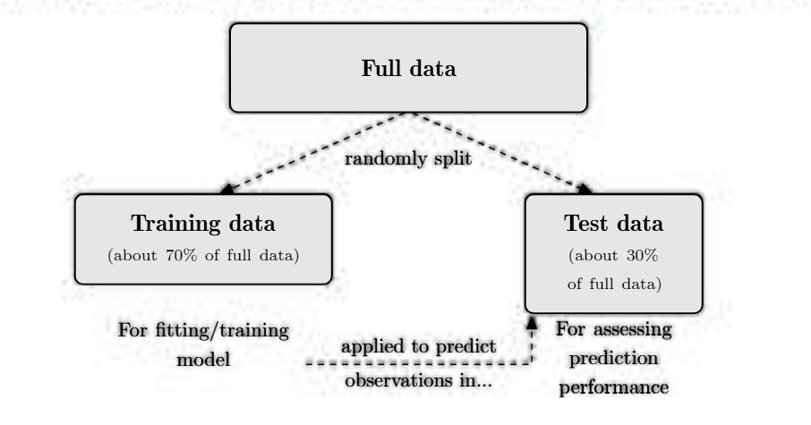

# (PART) Theory of and Case Studies in Predictive Analytics {-}

# Linear Models

```{r, include=FALSE}
source("_common.R")
```

```{block2, type='rmdnote'}

Topic:  Predictive Analytics Problem Defintion

Learning Objectives:  The Candidate will be able to identify the business problem, how the available data relates to possible analyses, and use the information to propose an appropriate modeling approach.
```

## A Primer on Predictive Analytics

This subsection streamlines the material scattered in different parts of the PA modules (which are notoriously difficult to digest) and presents a coherent introduction to predictive analytics.

The fundamental concepts introduced in this section are universally applicable in the sense that they apply to essentially all types of models, and will be illustrated in the context of specific types of models (generalized linear models and decision trees, in particular) in this and later chapters.

### Basic Terminology

**Predictive Analytics in a Nutshell:**

What exactly is predictive analytics? To answer this question, it may help to understand the three main categories of predictive modeling problems suggested by the PA modules:

-   **Descriptive:** Descriptive analytics focuses on what happened in the ***past*** and aims to "describe" or explain the observed trends by identifying the relationships between different variables in the data.
    -   **Example:** If you saw an increase in the lapse rate among the policyholders of a certain line of business, what kind of policyholders had the highest tendency to lapse? This is a question that can be answered by descriptive analytics.
-   **Predictive:** Predictive analytics focuses on what will happen in the ***future*** and is concerned with making accurate "predictions".
    -   **Example:** For a prospective policyholder with certain characteristics, what is their predicted probability of lapse? The ability to make such a prediction will be useful for identifying future policyholders who will have a lower probability of lapse and contribute to the profitability of an insurer.
-   **Prescriptive:** Prescriptive analytics uses a combination of optimization and simulation to investigate and quantify impact of different "prescribed" actions in different scenarios.
    -   **Example:** If we reduce the premium by a certain amount, how will this affect the lapse rate?

Not surprisingly, Exam PA is predominantly concerned with *predictive analytics*, although the three modeling approaches are often mutually complementary, not contradictory.

There is always an output (or outcome) of interest, which can be numeric (salary, premium, injury rates) or categorical (positive/negative, email/spam), and we have at our disposal a collection of input variables that may offer potentially useful information for predicting or understanding the output.

This "input-output" setting is characteristic of predictive analytics in general, and our job is to develop a model teasing out the (possibly complex, overlapping) contributions of inputs to the outputs.

**Classification of Variables:**

Predictive analytics requires data, often with a large number of observations and variables. Generally speaking, there are two ways to classify variables in a predictive analytics context: By their role in the study (intended use) or by their nature (characteristics).

-   **By Role:** The variable that we are interested in predicting is called the ***target variable***, or simply the ***target*** **(a.k.a response variable, dependent variable, output variable, outcome variable).**

    Despite the target variable being our interest, in most situations we cannot change the target variable directly, but we have control over some associated variables which can be used to predict the target. These variables go by different names, such as ***predictors, explanatory variables, independent variables, input variables***.

    In an actuarial context, predictors are also known as risk factors or risk drivers. In the remainder of this manual and in Exam PA, we will mostly use the term "predictors" and "features" (to be defined in Subsection 3.1.4).

    Throughout your study of predictive analytics, it is useful to think of a predictive model as the following functional relationship between the target variable $Y$ and the set of predictors $X = (X_{1}, ..., X_{p})$ (collected as a vector): $$
            \begin{equation}
            Y_{i} = f(X_{i}) + \epsilon_{i} (\#eq:linear-relationship)
            \end{equation}
            $$ Where:

    -   The subscript $i$ signifies the $i$th observation in your dataset, so $Y_{i}$ is the value of the target variable for the $i$th observation and $X_{i} = (X_{i1},..., X_{ip})$ is the corresponding vector of predictor values.

    -   The symbol $f$ is a fixed (non-random) but unknown real function connecting the predictors and the target variables. Without the subscript $i$ (it is $f$ rather than $f_{i}$), the function applies to all observations in the data, hence "systematic". Largely synonymous with the model, this function carries the systematic information that the predictors offer about the target variable, and allows us to differentiate, or discriminate, the observations of the target variable on the basis of those of the predictors.

        Different types of predictive models are distinguished by the structural form of this function, e.g., linear for linear models and piece-wise constant for decision trees, as we will see in later chapters.

    -   The symbol $\epsilon_{i}$ is a zero-mean random error term carrying information that is specific to the $i$th observation, hence "idiosyncratic" and the presence of the subscript $i$. It can be regarded as a catch-all for what the systematic component of the model misses, e.g., the true relationship between $X$ and $Y$ is probably more complex than \@ref(eq:linear-relationship), there are other variables associated with $Y$ omitted by the model.

        Although \@ref(eq:linear-relationship) looks abstract and the exam will not test it directly, it will provide a useful framework for thinking about predictive analytics.

        For convenience, we will refer to $f$ and $\epsilon$ respectively as the $\fbox{signal function}$ and the $\fbox{noise}$ which are engineering terms.

        We are interested in the signal, but the data we have is "contaminated" with noise. The goal of predictive analytics is to filter out the noise and use a variety of tools and techniques to learn as much about the signal as possible from the data. This knowledge about the signal can then provide us with a basis for understanding the data-generating process underlying the population of interest, and making predictions for the target variable.

<!-- -->

-   **By Nature:** Variables can also be classified as *numeric* variables or *categorical* variables. Such a classification has important implications for developing an effective predictive model that aligns with the character of the target variable and predictors to produce realistic output.

    1.  **Numeric Variables:** Numeric variables take the form of numbers with a well-defined order (e.g., 1 must be less than 2) and an associated range. They can be further classified as:

        -   **Discrete variables:** Restricted to only certain numeric values in that range, e.g., non-negative integers.

        -   **Continuous:** Can assume any value in a continuum, at least in theory.

    2.  **Categorical Variables:** Categorical variables take predefined values in a countable collection of "categories". These categories, which often have no numeric order (i.e., we cannot say which category is larger or smaller), are called the **levels** or **classes** of the variable. Here are some examples of properties that can be described by categorical variables:

        -   Gender (male, female, or non-binary)

        -   Smoking status (smoking or non-smoking)

        -   Risk group (preferred, standard, rated, or un-insurable)

        -   Marital status (single, married, divorced, or widowed)

        An important special case of a categorical variable is a **binary** variable, which only takes two possible levels (often yes or no), indicating whether an event has taken place or whether a characteristic is present.

        In many datasets in practice, categorical variables are represented by numbers, but note that coding the levels of a categorical variable by numbers does not make the variable numeric. Consider, for instance, the variable $X$ which represents smoking status and is encoded as: $$
        X = \begin{cases} & \text{0, for a non-smoker,} \\ & \text{1, for a smoker,} \\ & \text{2, for an individual with unknown smoking status.}  \end{cases}
        $$

        Even though the three levels "non-smoker", "smoker", and "unknown" have been coded as "0", "1", and "2", respectively, the three numbers are merely labels without an implicit order and cannot be compared in an algebraic fashion. For example, "1" is not less than "2" in a meaningful fashion in this case.

    In predictive modeling, the type of model to use is largely determined by the nature of the target variable, not the predictors.

    In other words, the distinction between continuous and categorical variables is relatively unimportant when they serve as predictors of a model, but we need to take the distinction properly into account when they serve as the target variable. Some predictive models (e.g., linear models) will work well only for continuous target variables while some (e.g., generalized linear models and decision trees) apply to both numeric and categorical target variables.

**Supervised vs. Unsupervised Problems:**

Predictive analytics problems can also be classified into *supervised* and *unsupervised* problems, depending on the presence of a target variable and the objective of analysis.

-   **Supervised Learning Problems:** They refer to those for which there is a target variable "supervising" or guiding our analysis, and our goal is to understand the relationship between the target variable and the predictors, and/or make accurate predictions for the target based on the predictors.

    -   **Types of Supervised Learning Methods:**

        -   Generalized Linear Models (GLMs)

        -   Decision Trees

-   **Unsupervised Learning Problems:** For unsupervised learning methods, there is no target variable supervising our analysis (we are therefore "unsupervised"), and we are interested in extracting relationships and structures between different variables in the data.

    -   **Types of Unsupervised Learning Methods:**

        -   Principal Components Analysis (PCA)

        -   Cluster Analysis

Note that supervised and unsupervised learning methods are sometimes used in conjunction with one another. As we will see in Chapter 6, unsupervised learning methods can be used for the purposes of data exploration and producing potentially useful features for predicting the target variable more accurately.

**Regression vs. Classification Problems:**

In predictive analytics, it is customary to refer to supervised learning problems with a numeric target variable as ***regression*** problems (an exception is logistic regression, for which the target variable is binary; see Chapter 4. In contrast, when the target variable is categorical in nature, we are dealing with ***classification*** problems. A predictive model for predicting a categorical target variable involves "classifying" its observations to a certain level and is aptly called a *classifier*.

Both regression and classification problems are of importance in predictive modeling in general. The two kinds of predictive analytics problems have their unique features and will covered in detail in Part II of this manual.

### The Model Building Process

Now that we have a first taste of what predictive analytics is like, in this important and rather lengthy subsection we will walk through the main steps involved in the construction and evaluation of a predictive model.

In practice, model building typically requires a sequence of complex and inter-related decisions. The whole process is iterative and often more of an art than a science. The framework here is necessarily simplified and focuses on the most important steps in Exam PA, but is rich enough to show you what it takes to build a good model in real life.

#### Stage 1: Problem Definition

The first step in any model building exercise is to clearly formulate the business problems to which predictive analytics will be applied.

##### Characteristics of Predictive Modeling Problems {.unnumbered}

Before we decide to apply predictive analytics to solve a business problem, we should ensure that it is indeed a problem that should be addressed by predictive modeling.

A conceptual exam task testing the syllabus learning outcome, "Describe the characteristics of predictive modeling problems.", may ask:

```{block2, type='rmdimportant'}
Explain two (or three) reasons why this business problem should be addressed by predictive modeling*
```

Some common characteristics of predictive modeling problems include:

```{r echo=FALSE, message=FALSE, warning=FALSE}
library(lares)
library(knitr)
library(kableExtra)


markdown_table <- "
| Characteristic | Description |
|:---------------|:------------|
| **Issue** | There is a clearly identified and defined business issue that needs to be addressed. |
| **Questions** | The issue can be addressed with a few well-defined questions (What data do we need? What is the target or outcome? What is the success criteria / how will the model performance be evaluated?) |
| **Data** | Good and useful data is available for answering the questions above. |
| **Impact** | The predictions will likely drive actions or increase understanding. |
| **Better Solution** | Predictive analytics likely produces a solution better than any existing approach. |
| **Update** | We can continue to monitor and update the models when new data becomes available. |
"

df <- markdown2df(markdown_table)

knitr::kable(df, caption = 'Characteristics of Predictive Modeling Problems')
```

A typical predictive modeling problem will have most, but not necessarily all of these characteristics.

##### Problem Definition {.unnumbered}

After deciding to use predictive analytics to address the business issue of interest, we should define the problem as clearly as possible.

It is important to get to the root cause of the business issue and make it specific enough to be solvable.

The following strategies suggested can help us come up with a meaningful problem definition and give our project a higher chance of success:

-   **Hypotheses:** It is useful to use our prior knowledge of the business problem to ask questions and develop hypotheses that can prove or disprove in the course of our analytic work. Doing so helps us gain a clearer understanding of the business issue and guide our efforts in a clearly defined way. With the questions and hypotheses, we know where to focus on.

-   **KPI's:** We also need ways to assess the outcome by selecting appropriate key performance indicators (KPI's), which will provide a quantitative basis to measure the success of the project. Naturally, these KPI's should align with the overall business strategy as far as possible and show the client what key numbers will change as a result of your predictive analytic work.

##### Constraints {.unnumbered}

As soon as we have defined the business problem clearly, it is important to evaluate the feasibility of solving the business problem and implementing the predictive analytic solution.

We want to make sure that the solutions we produce will work. Some considerations and constraints we should keep in ind when evaluating and prioritizing business problems include:

-   The availability of easily accessible and high-quality data.
-   Implementation issues such as the presence of necessary IT infrastructure and technology to fit complex models efficiently, the timeline for completing the project, and the cost and effort required to maintain the selected model.

Do we have the resources to implement complex models without freezing or crashing? If a model is operationally prohibitive to execute, then it makes sense to trade some prediction performance for ease of implementation. After all, if we cannot actually implement and apply the model in practice, then it is basically useless.

#### Stage 2: Data Collection and Validation

Predictive analytics relies on models, which in turn are constructed from data. After defining the business problem properly, we will spend some time and effort collecting useful data that will underlie the predictive models we are going to build.

This data collection stage is more important and intricate than you probably first thought. You may have heard of the phrase "garbage in, garbage out", better known as GIGO, which means that low-quality data is doomed to produce low-quality output.

Here we will learn some key considerations and some pitfalls to avoid related to the collection and use of data.

##### Data Design {.unnumbered}

To begin, we will contemplate here to collect the data to be used in the modeling stage.

At the data design stage, there are a few things we should take note of to maximize the usefulness of our data source, which is the entire set of observations that enter the dataset you collect.

-   **Relevance:** Intuitively, the more data we have, the more information available and the better, provided that the data is unbiased (e.g., representative of the environment where our predictive model will operate). To ensure that the data is relevant for our business problem, it is necessary to source the data from the right population and time frame.

    -   **Population:** As obvious as this may seem, it is important that the data source aligns with the true population we are interested in. If the data source is not a reasonably good proxy of a representative sample, then taking a larger dataset does not help, we are only representing the bias over again and again.

    -   **Time Frame:** When selecting an appropriate time frame for our data, it is advisable to choose the time period which best reflects the business environment in which we will be implementing our models. In general, recent history is more predictive of the near future than distant history, so data one year ago should be more useful than data 10 years ago, other things equal.

    **Example 3.1.1: Problems with a Facebook Poll**

    In November 2020, the Divide States of America (DSA) held its 60th presidential election, with Donald Dump running against Joe Hidden. To gauge public sentiments towards the election, Great News Network (GNN), a/an information outlet, set up a poll on Facebook allowing users to vote for their preferred presidential candidate. Any Facebook users could take part in the poll, which was open between August 2020 and September 2020.

    Evaluate the quality of the data collected by GNN with respect to the population, time frame, and/or other items.

    ***Solution:*** There are quite a few problems with the data collected by GNN, some of which are:

    -   **Population:** The votes were limited to Facebook users while the intended audience was supposed to be all eligible citizens of DSA. Users of social media outlets tend to be younger generations, so there may be a systematic mismatch between the voters of the poll and the general population.

    -   **Time Frame:** The objective of the poll was to understand voters' preferences at the time of the November 2020 election. The poll, conducted between August 2020 and September 2020, was premature in a way and might fail to gauge public sentiments accurately (a lot could happen in October). It may be desirable for the poll to extend to October, right before the November election took place.

    -   **Quality:** By design, the data collected is susceptible to ***contamination***. An individual may register for several accounts and take part in the poll several times. The repetitive votes are allowed by the poll could substantially bias the polling results.

    **Example 3.1.2 Considerations with Time Frame (Based on Exercise 2.1.1 in the PA Modules)**

    Suppose that you are constructing a model to predict which retirement option a customer will choose. You have data from 1990 to 2020 containing your customers choices. In 2010, your company introduced a digital platform, which increased not only the variety of retirement options available, but also the richness of the supporting data available to customers when they made their decisions.

    Discuss the pros and cons of including all of the data from 1990 relative to including only the data from 2010 for constructing your predictive model.

    ***Solution:***

    -   **Pros:** Including all of the data from 1990 means more data. Other things equal, having more data is generally desirable as it makes model training more robust and less vulnerable to noise.

    -   **Cons:** In predictive modeling, it is important to select the period of time that best reflects the environment in which we will be implementing our model. In this case, something happened in 2010 which significantly affected the behavior of the outcome (retirement options) we are modeling. This makes the data prior to 2010 less likely to be predictive of current and future behavior of customers. Including such (outdated) data may make the predictions of retirement options in the current era less accurate.

-   **Sampling:** Sampling is the process of taking a subset of observations from the data source to generate our dataset.

    Why do we need to bother with sampling? Why not use the entire data source? In reality, the underlying population is often too big to handle, and we need a smaller, much more manageable subset to form our data.

    The observations sampled should closely resemble the business environment in which our predictive model will be applied in the future. In fact, a good time frame, discussed above, can be seen as a form of sampling, which the same goal of making sure that our data is representative.

    There are a number of sampling methods commonly used to draw an appropriate sample:

    -   **Random Sampling:** This is the simplest sampling scheme by which we "randomly" draw observations from the underlying population without replacement until we have the required number of observations. Each record is equally likely to be sampled.

        -   One common way to achieve **random sampling** is through a survey or questionnaire. Individuals in the population are invited to respond to the survey and contribute to the collected dataset.

            However, voluntary surveys are known to be vulnerable to ***respondent bias***. Only those interested will respond, which means that the respondents of a survey may make up a population different from the the population of interest.

            For example, university students who respond to end-of-semester course evaluations tend to be those who feel strongly about the courses they take. These students with strong opinions may substantially bias the results of the course evaluations which are supposed to be for the general students.

            Surveys also tend to suffer from a ***low response rate***, unless there are financial incentives for people to respond.

    -   **Stratified Sampling:** Stratified sampling involves dividing the underlying population into a number of non-overlapping "strata" or groups in a non-random fashion, and randomly sampling (with or without replacement) a set number of observations from each stratum.

        This sampling method has the notable advantage of ensuring that every stratum is properly represented in the collected data. In Exam PA, the strata are usually formed with respect to the distribution of the target variable.

        Here are a few special cases of **stratified sampling**:

        -   ***Oversampling and Undersampling:*** These are sampling methods designed specifically for unbalanced data, and we will learn about them in detail in Subsection 4.1.4.

        -   **Systematic Sampling:** By systematic sampling, we draw observations according to a set pattern and there is no random mechanism controlling which observations are sampled.

            For a population with 100,000 units, we may order them in a well-defined way and sample every tenth observation to get a smaller, more manageable sample of 10,000 units. Once the sampling rule has been set, the sampled observations are pre-determined.

-   **Granularity:** Granularity refers to how precisely a variable in a dataset is measured, or equivalently, how detailed the information contained by the variable is. As an example, location, in ascending order of granularity, can be recorded in different degrees of precision:

    -   By Country (least granular)

    -   By State

    -   By City

    -   By Zip Code

    -   By Address (most granular)

    From country to address, we have more and more specific information about the location of an individual.

    At the data design stage, it is a good idea to use a relatively high level of granularity. It is always possible to go from a higher level of granularity to a lower level of granularity down the track, but not the other way around.

##### Data Quality Issues {.unnumbered}

Once we have collected the data from a data source representative of the population of interest using an appropriate sampling method, we have to take an important step before jumping straight into doing predictive modeling: ***Data Validation***, the process of ensuring the quality and appropriateness of the data available.

If the collected data falls short of our standards, we may have to go back to the data collection step and search for an alternative dataset.

-   **Reasonableness:** For a dataset to be useful, the data values should, at a minimum, be reasonable, which can be checked by exploratory data analysis. Do the key statistics for the variables make sense in the context of the business problem? If one of the variables is income and one observation has a negative income, then almost certainly this is a recording error that should be fixed before we launch into model construction.

-   **Consistency:** We also need to ensure that the records in the data are inputted consistently, meaning that the same basis and rules have been applied to all values, so that they can be directly compared with one another.

    -   ***Numeric Variables:*** For numeric variables, the same unit should be used across all rows of the data for consistency. If one of the variables is weight, the nits values should be measured either all in kilograms or all in pounds. If there is a monetary variable, such as income, then the same currency should be used throughout.

-   ***Categorical Variables:*** We should make sure that the factor levels of categorical variables are defined and recorded consistently over time with no coding changes, like either the full name (e.g., Iowa) or the two-character abbreviation (e.g., IA) for the state of policy issue.

```         
To check consistency, it is necessary to gain knowledge of how the data entries are recorded. To this end, the data dictionary (see the next point) that accompanies each PA exam project will be useful.

If we want to combine multiple datasets to form new variables (columns) or new observations (rows), then the consistency checks above extend to all constituent datasets to make sure that the concatenation works properly.

If we need to join datasets by a certain variable (column), it is especially important to ensure that the format of that variable is consistent across both datasets to ease matching, e.g., name should be recorded either as [first name] or [last name], [first name] so that each person can be identified uniquely. The possible existence of a middle name adds further complication.
```

<!-- -->

-   **Sufficient Documentation:** A good dataset should also be sufficiently documented so that other users can easily gain an accurate understanding of different aspects of the data. The PA modules suggest that effective documentation should at least include the following information:

-   A description of the dataset overall, including the data source (how and when the dataset was collected).

-   A description of each variable in the data, including its name, definition, and format (range of values for numeric variables and the possible levels for categorical variables).

-   Notes about any past updates or other irregularities of the dataset.

-   A statement of accountability for the correctness of the dataset.

-   A description of the governance processes used to manage the dataset.

Exam PA exam project describes the dataset in the "Business Problem" section and provides you with a *data dictionary*, which lists all the variables in the data together with their information. Here is a sample data dictionary for a hypothetical group of insurance policies:

```{r echo=FALSE, message=FALSE, warning=FALSE}


    convert_md_table_to_kable <- function(markdown_table="", caption_text="") {
      library(lares)
      library(knitr)
      library(kableExtra)
      
      df <- markdown2df(markdown_table)

      df %>% 
        kbl(df, format="html", caption=caption_text) %>% 
        kable_styling(
          bootstrap_options=c("striped", "hover", "condensed", "responsive"), 
          full_width=F, 
          position="center", 
          fixed_thead=T)
    }

    markdown_table <- "
    | VariableName	| Description	| Values |
    |:--------------|:------------|:-------|
    | `age` | The age of a policyholder | Integer, 20 to 65 |
    | `gender` | The gender of a policyholder | 3 levels, “F”, “M”, and “0” |
    | `type` | The risk type of a policyholder | 2 levels, “standard” and “substandard” |
    | `n_claims` | The number of claims submitted | Integer, 0 to 10 |
    | `claims` | The total amount of claims | Numeric, 0 to 30,451.8 |
    "

    convert_md_table_to_kable(markdown_table=markdown_table, caption="Sample Data Dictionary")
```

##### Other Data Issues {.unnumbered}

Even if a dataset is representative of the population of interest and is of sufficient quality, there are additional regulatory and practical issues related to the collection and use of data that we need to be aware of.

-   ***PII***: It is not uncommon that datasets contain personally identifiable information (PII). Examples of such include name, Social Security number, address, photographs and bio-metric needs.

    -   Anonymous: Needs to comply with the pertinent laws since processing of data is still required.
    -   Data Security: Ensure that personal data receives sufficient protection such as encryption and access restrictions
    -   Terms of Use: Be well aware of all terms and conditions and the privacy policy related to the collection and use of data.

-   **Variables with Legal/Ethical Concerns**: Race, Gender, Ethnicity, Age, Income, Disability Status may be controversial variables that are a part of the dataset, and differential treatment based on these variables may lead to unfair "discrimination" and regulation violations.

    Proxies of Prohibited is occupation, which can be strongly correlated with gender, and coal mine workers. If we use occupation as a predictor, then even though we are not feeding gender directly into our model, we are still using the information about the gender indirectly.

-   **Target Leakeage**: In predictive modeling, target leakage refers to the phenomenon that some predictors in a model include ("leak") information about the target variable ***that will not be available when the model is applied in practice***. These predictors are typically strongly associated with the target variable, but their values are not known until or after the target variable is observed. Remember that our aim when doing predictive analytics is to use the other variables to predict the target variable ***before*** it is observed, so these "predictors" cannot serve as predictors in reality. If we include these variables in the model construction process, then our model will appear to perform extraordinarily well.

    Examples of Target Leakage:

    -   Suppose you are interest in predicting whether or not a policyholder of an insurance policy will incur a loss or not in a future period (binary target variable). If the number of incurred losses is one of the predictors you use, then it appears that you will be able to make the perfect predictions: ***By definition, an incurred loss must have arisen if the number of incurred losses is one or more**. The number of incurred losses simply would not be available at the time we predict the occurrence of incurred losses in practice.*

    -   An extreme form of target leakage that is commonly tested on the exam is when the target variable itself is included as a predictor, or is used to develop new variables (e.g., principal components) for predicting the same target variable.

        Exercise 3.1.7. \*& (Detecting target leakage) Consider the persinj dataset in Chapter 2 again, and treat amt as the target variable. The data dictionary is reproduced below:

        | Variable | Description |
        |----|----|
        | `amt` | Settled claim amount (continuous numeric variable) |
        | `inj` | Injury code, with seven levels: 1 (no injury), 2, 3, 4, 5, 6 (fatal), 9 (not recorded). |
        | `legrep` | legal representation (0 = no, 1 = yes) |
        | `op_time` | Operational time (standardized amount of time elapsed between the when the injury was reported and the time when the claim was settled) |

        1)  Identify a variable in the dataset that may pose the problem of target leakage.
        2)  Suggest how to retain the variable in part (a) for constructing meaningful predictive models for amt.

        **Solution.**

        1.   The `op_time` variable may pose the problem of target leakage when amt is the target variable. According to the data dictionary, the value of op_time would not be known until a claim was settled, at which time the value of amt would be observed. Due to this timing issue, `op_time` ma not serve as a predictor of `amt` in practice.
        2.  We can first build a predictive model for `op_time` based on the variables other than `amt` and then use a separate predictive model to predict the `amt` based on the predicted value of `op_time` and/or other variables.

#### Stage 3: Exploratory Data Analysis

After we have collected and validated the data, the next step is to perform **Exploratory Data Analysis**, which was discussed in Section \@ref(2.2) with a focus on R programming and will further be illustrated in the case studies sections in the later part of this manual. The goals of exploratory data analysis are the same as those presented in Section \@ref(2.2):

**Exploratory Data Analysis**

:   With the use of descriptive statistics and graphical displays, clean the data for incorrect, unreasonable, and inconsistent entries, and understand the characteristics of and the key relationships among variables in the data.

    The observations we make may suggest an appropriate type of predictive model to use (e.g., GLMs vs. Decision Trees) and the best form for the predictors to enter the model.

#### Stage 4: Model Construction, Evaluation, and Selection [IMPORTANT!]

Having defined the problem, collected some useful data, and taken a first look at the key variables, it is time for us to move onto the modelling phase and construct our predictive models in earnest.

##### **Should we use all available data to train our models?** 

You may be tempted to fit your predictive models directly to the whole set of data. Remember that one of the main goals when doing predictive modeling is to construct models that make good predictions. The fundamental question is is:

How do we go about designing a predictive model that performs well when it is applied to ***new, previously unseen*** data? In other words, how do we make sure that the model calibrated on ***past*** data excels in predicting ***future*** target values on the basis of ***future*** predictor values?

If we use all of the collected data for model fitting, that will leave no independent data for assessing the prediction performance of our models. It does not help much to evaluate the models on the same data on which they were built. After all, the models have seen those data and are not making genuine predictions. To ensure that our predictive models do a good job of describing the past data they have seen and, more importantly, prediction new, *future* observations, we need an unconventional way of leveraging our available data.

##### **Training / Test Set Split** 

To construct a model that thrives on future data, it is common practice in predictive analytics to partition our data into a few parts, each of which plays a different role in the model development and evaluation process.

The simplest way is to split the full data into two parts, the training set and the test set; see Figure \@ref(fig:figure-schematic-diagram) for a schematic diagram.

{#figure-schematic-diagram}

**Training Set**

:   The larger part of the full data (70-80%), the *training set*, or *training data*, is where you "train", fit, or develop your predictive model to estimate the signal function $f$ and, if needed, the model parameters.

    The training is typically done by optimizing a certain objective function that describes how well the model matches the training observations. The fitted model is denoted by $\hat{f}$ , where the hat emphasizes that it is an estimate of $f$. After the model has been trained, it is ready for making predictions on the other part of the full data.

**Test Set**

:   Following the fitting, you will apply the trained model to make a prediction for each observation in the *test set*, or *test data*, and assess the prediction performance of the model according to certain performance metrics.

    Observations in the test set [**did not participate in the model training process**]{.underline} and will provide a much more objective ground for evaluating prediction performance when the model is applied to new, future data.

    In contrast, evaluating the model on the training set will give an overly optimistic and somewhat misleading picture of its true predictive performance – the model has already seen the training observations and is merely fitting, not predicting those observations.

**How to Split the Data?**

There are many ways to do the training/test split.

-   It can be done ***purely randomly*** according to pre-specified proportions,
-   Using special ***statistical techniques*** that ensure the distributions of the target variable in the two sets are comparable (stratified sampling).
-   If one of the variables is a ***time-variable***, such as calendar year or month, and the behavior of the target variable over time is of interest, then one more way to make the split is on the basis of time, allocating older observations to the training set, and the more recent observations to the test set. Such "out-of-time" validation is conducted often for time series data, also known as longitudinal data, and is use for evaluating how well a model extrapolates time trends observed in the past to future periods.

**How many observations should we assign to the two sets?**

The relative size of the training and test sets involves a trade-off:

-   Having more training data will make for a more robust predictive model more capable of learning the patterns in the data and less susceptible to noise.
-   If too little data is set aside for the test set, however, the assessment of the prediction performance of the trained model on new, unseen observations will be less reliable.

**How to use the training/test set split to rank competing models?**

If we have multiple candidate models, then we can perform the following steps:

1.  Split the data into training / test sets..
    -    The same training and test sets should be used across all candidate models.
2.  Fit the models to the training set.
3.  Evaluate the quality of these models on the test set; and
4.  Choose the one with the best test set performance according to a certain model selection criterion.

When the "test set" above is for *selecting* the best model and is more commonly referred to as the ***validation set***.

**Test /Validation Set** 

:   In many predictive modeling textbooks, the test set is where we obtain an independent measure of the prediction performance of your ***chosen model*** **when** it is applied to data not involved in training or ***selecting*** the final model. The test set is held out until the end.

    The usage in this manual conforms to what you will likely see in PA exam projects, where we are more concerned with finding the best predictive model and less with exactly how well it performs on independent data. There is usually no independent test data set aside for final evaluation.

##### Common Performance Metrics

::: {.theorem}
For a right triangle, if $c$ denotes the length of the hypotenuse and $a$ and $b$ denotes the length of the other two sides, we have

$$a^2 + b^2 = c^2$$
:::

#### Stage 5: Model Validation

#### Stage 6: Model Maintenance

### Bias-Variance Trade-Off

### Feature Generation and Selection

## Linear Models: Conceptual Foundation

### Model Formulation

### Model Evaluation and Validation

### Feature Generation

### Feature Selection

### Regularization

## Case Study 1: Fitting Linear Models in R

### Exploratory Data Analysis

### Simple Linear Regression

### Multiple Linear Regression::::

### Evaluation of Linear Models

## Case Study 2: Feature Selection and Regularization

### Preparatory Work

### Model Construction and Feature Selection

### Model Validation

### Regularization

## Conceptual Review: Questions for Chapter 3 {.unnumbered}
